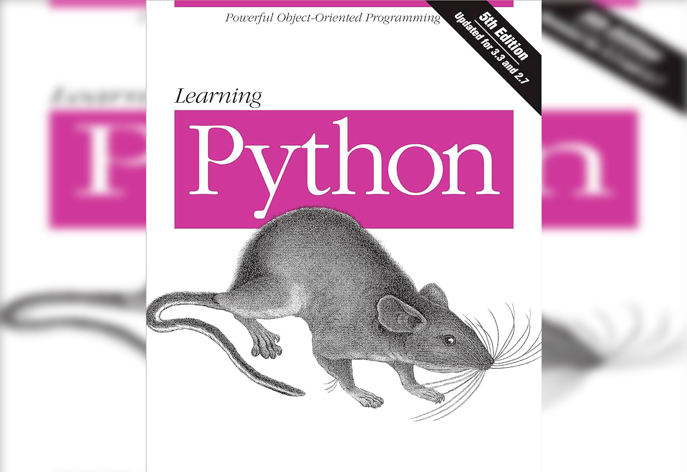

В этом конспекте в первую очередь представлены ответы на вопросы по книге, а также новые для меня вещи, которые я вынес после прочтения каждой главы. Какие-то главы, части или вопросы опускаются, если из них не извлечено ничего до момента прочтения мне неизвестного или за ненадобностью (субъективно).

Конспект будет пополняться по ходу прочтения книги
<!--more-->

Общие вопросы, которые возникали по ходу прочтения, и на которые я находил ответы на просторах интернета:

* JIT-компилятор (just in time) — компилятор, выполняющий команды по ходу исполнения самой программы, в отличии от AOT-компилятора (ahead-of-time), который компилирует программу перед её непосредственным исполнением.

* Python REPL (read-evaluate-print loop) — интерактивный режим, в котором интерпретатор считывает команды построчно и сразу же выполняет их (выводя результат на экран, если нужно)

* Различия IDLE и IDE: IDE (integrated development environment — интегрированная среда разработки) — программа, в которой разработчики пишут, тестируют и запускают код. Например VS Code. IDLE (Integrated Development and Learning Environment) — стандартная среда разработки Python. Обычно поставляется вместе с самим ЯП. Низкая функциональность, по сравнению с тем же VS Code. 

* Файл с расширением `.pyw` — тот же самый `.py`, но при выполнении `*.pyw` терминал/консоль не открывается. При этом, файлы с расширением `.pyw` выполняются программой `pythonw.exe`, в то время как файлы с расширением `.py` выполняются `python.exe`.

* Есть очередной способ форматирования строки, где вместо %s подставляется строковый объект из скобок. По функционалу один в один `format()`, полагаю.

# Часть 1. Начало работы

## Глава 2. Как Python выполняет программы
1. Интерпретатор Python — программа, выполняющая написанные программы на Python

2. Исходный код — последовательность операторов, записанная в текстовом файле с расширением `.py`

3. Байт-код — форма кода, полученная путём компиляции исходного кода для последующей интерпретации. Не пересоздаётся, если программа была запущена повторно без изменения исходного кода и если версии Python при создании и запуске совпадают. Хранится в файле расширений `.pyc`.

4. PVM — Python virtual machine (виртуальная машина Python). Нужна для интерпретации (исполнения) скомпилированного байт-кода.

5. CPython, Jython, IronPython, PyPy, Stackless и т.д.

6. CPython — стандартная реализация. Jython — реализация Python для интеграции с Java, а IronPython для интеграции с .NET.

7. Stackless — реализация Python, направленная на обеспечение параллелизма, PyPy — реализация Python, направленная на обеспечение высокой скорости выполнения. PyPy также является преемником Psyco, включает в себя концепции JIT-компилятора и поддержку Stackless.

---
## Глава 3. Как пользователь выполняет программы

### Что нового
- Узнал больше про IDLE, научился им пользоваться;
- Узнал как использовать интерактивный интерпретатор.

### Ответы на вопросы
1. Сеанс интерактивного интерпретатора можно запустить следующими способами:
    * В командной строке (Windows), терминале (Unix) путём введения команды `python` (или `py`)
    * Найти значок запуска "Python \<v\>" в меню пуск
    * Запуск среды IDLE

2. В командной строке (Windows) или терминале (Unix).

3. Модули можно запускать следующими способами:
    * С помощью командной строки: `python <filename.py>`
    * Щёлкнуть на значок файла
    * Импортирования и перезагрузки: 
    ```py
    from importlib import reload
    import Studying
    reload(Studying)
    ```
    ```
    # Вывод:
    Hello World!
    Hello World!
    ```
    * Использовать встроенную функцию `exec()`: `exec(open("Studying.py").read())`
    * С помощью IDE

4. При открытии файла `.py` щелчком, после завершения программы окно моментально закрывается, из-за чего становится проблематичным рассмотреть вывод и сообщения об ошибках.

5. По умолчанию Python импортирует модуль единожды за сеанс (так как операция импорта довольно затратна), поэтому если исходный код был изменён и требуется выполнить новую версию, не перезапуская Python, на помощь приходит перезагрузка модуля командой `reload()`.

6. Чтобы запустить модуль в IDLE, нужно, для начала, находиться непосредственно в текстовом редакторе IDLE с открытым файлом модуля, там нажать *Run Module*.

7. IDLE виснет и не сильно надёжный.

8. Пространство имён — пакет переменных (имён). Каждый файл модуля автоматически является пространством имён, то есть пакетом переменных, которые отражают присваивания, сделанные на верхнем уровне файла.

---
# Часть 2. Типы и операции

## Глава 4. Введение в типы объектов Python

### Что нового
* Unicode — это стандарт, который определяет уникальные числовые коды (code points) для каждого символа в различных письменных системах мира; UTF-8 (Unicode Transformation Format) — кодировка, представляющая эти числовые коды в последовательности байтов.

* Существует стиль форматирования строк, в котором используются `%`. Лично я не вижу смысла им пользоваться, так как существуют более свежие и быстрые альтернативы (`f-strings`, `format()`), но полезно для общего развития. Пример:
```py
name = "Ivan"
print('Hello, %s' % name)
print('%s, my friend %s' % ('Hello', name))
```

```
# Вывод: 
Hello, Ivan
Hello, my friend Ivan
```

* Забывшееся: в один принт можно читабельно (без прописывания литералов) уместить многострочный текст, обрамляя его тремя парами кавычек:
```py
print("""Hello and welcome to the Los Pollos Hermanos family.
My name is Gustavo,
but you can call me Gus.""")
```

* Существует тип данных `bytes` — байтовый объект (строка байтов). Как и `str`, является неизменяемым. Также есть изменяемый эквивалент — массив байтов `bytearray`.

### Ответы на вопросы
1. Основными типами данных в Python являются `None`, булевские значения, числа (целые, с плавающей точкой и комплексные), строки (текстовые и байтовые), списки, кортежи, множества, словари и файлы.

2. "Основными" они называются, так как для их использования не нужно импортировать модули, да и просто их используют чаще всего.

3. В Python есть три основных неизменяемых (то есть без возможности модификации после создания) типа данных: числа, строки, кортежи. 

4. "Последовательность" — позиционно упорядоченная коллекция объектов. Ими являются строки, списки и кортежи.

5. "Отображение" — объект, состоящий из пар "ключ-значение". В Python им является словарь.

6. Полиморфизм в Python представляет из себя разное поведение одного и того же метода/оператора в разных классах.

---
## Глава 5. Числовые типы

### Что нового
* Целые числа могут кодироваться в десятичной, шестнадцатеричной (запись начинается с `0x` или `0X`), восьмеричной (`0o` или `0O`) и двоичной (`0b` или `0B`) системах счисления. Не зависимо от того, в какой системе счисления представлено число, в памяти оно хранится одинаково.

* Комплексные числа имеют вещественную и мнимую часть. Вторая записывается с литералом `j` или `J` на конце. Внутренне этот тип данных реализован в виде суммы пары чисел с плавающей точкой. Создать их можно с помощью функции `complex(real, imag)`. Комплексные числа поддерживают атрибуты, которые извлекают части числа, математические выражения и работу с функциями модуля `cmath` (аналог модуля `math` для комплексных чисел).

* Побитовые операции используются в основном в более низкоуровневых языках, но в Python они тоже есть. Вообще, если в программе приходится их использовать, стоит задуматься, тот ли язык вы используете. 

    В побитовых операциях Python работает с числами в их бинарном представлении. Рассмотрим основные битовые операторы: `&`, `|`, `^`, `~`, `<<` и `>>`.

    `&` — сравнивает биты попарно и вставляет 1, если 1 присутствует в обоих числах:
    ```py
    print(12 & 15)  #0b1100 & 0b1111 = 1100

    # Вывод: 12
    ```

    `|` — сравнивает биты попарно и вставляет 1, если 1 присутствует хотя бы в одном из чисел:
    ```py
    print(9 | 13)  #0b1001 | 0b1101 = 0b1101

    # Вывод: 13
    ```

    `^` — сравнивает биты попарно и вставляет 1, если сравниваемые биты совпадают, в противном случае — 0:
    ```py
    print(90 ^ 22)  #0b1011010 ^ 0b10110 = 0b1001100

    # Вывод: 76
    ```

    `~` — побитово инвертирует число, таким образом положительное число становится отрицательным со смещением -1. Также отрицательное число становится положительным со смещением на -1.
    ```py
    print(~-80)

    # Вывод: 79
    ```

    `<<` и `>>` — сдвиги влево и вправо соответственно. Справа от операторов пишется число — количество бит, на которые нужно сдвинуть левый операнд:
    ```py
    print(1 << 2)  #0b0001 << 2 = 0b0100

    # Вывод: 4
    ```
    ```py
    print(5 >> 1)  #0b0101 >> 1 = 0b0010

    # Вывод: 2
    ```

**Примечание.** Марк Лутц относит множества к числовому типу данных, с чем я категорически не согласен как минимум потому что множество — это коллекция. Лично я считаю, что к числовому типу данных следует относить только следующие типы: целые числа, числа с плавающей точкой, комплексные числа и другие вариации этих типов, такие как Decimal, Fraction и т.д.

### Ответы на вопросы
4. Для нахождения квадратного корня и квадрата числа можно использовать оператор `**`, встроенную функцию `pow()` или функции `pow()` (возведение в степень) и `sqrt()` (вычисление квадратного корня) из модуля `math`.

6. Усекать и округлять число с плавающей точкой можно следующими способами: 
* `int(x)` — отбрасывает дробную часть;
* `math.trunc(num)` — действует аналогично предыдущему варианту;
* `round(num, n)` — округляет число к ближайшему чётному с точностью до `n` знаков после запятой;
* `math.floor(num)` — округляет число вниз;
* `math.ceil(num)` — округляет число вверх:
* и т.д.

7. Целое число можно преобразовать в число с плавающей точкой с помощью функции `float(num)`, смешивания целых чисел и чисел с плавающей точкой в выражениях, операцией `/`.

8. Чтобы отобразить целое число в двоичном, восьмеричном и шестнадцатеричном представлениях, можно воспользоваться встроенными функциями `bin()`, `oct()` и `hex()` соответственно.

9. Если нужно преобразовать строку, содержащую число, представленное в другой системе счисления, нужно использовать функцию `int(string, base=10)`, передав ей в качестве второго аргумента число, обозначающее основание системы счисления.

---
## Глава 7. Фундаментальные основы строк

### Что нового
* Неформатированную строку (`r''`) нельзя оканчивать косой чертой

### Ответы на вопросы
1. Метод `find()` может использоваться только для строк.

2. Срез можно применять как к строкам, так и к спискам. 

3. Чтобы преобразовать символ в его целочисленный код ASCII, можно воспользоваться функцией `ord()`. Обратное преобразование проводится через функцию `chr()`.

4. Строка — неизменяемый объект в Python.

5. Допустим, нужно извлечь два символа между запятыми из след. строки: `"s,pa,m"`. Это можно сделать как минимум двумя способами. 1 — разделить по запятым и извлечь из полученного списка элемент по индексу 1. 2 — срез `[2:4]`. 

6. Следующая строка содержит шесть символов: `'a\nb\x1f\000d'`, а конкретно: символ `'a'`, символ перевода строки `'\n'`, шестнадцатеричную последовательность `'\x1f'`, восьмеричную последовательность `'\000'` и символ `'d'`.