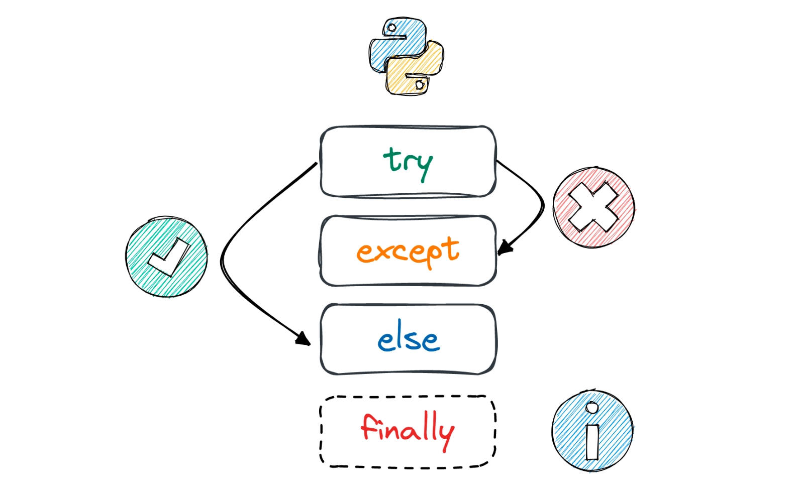

Конспект посвящён исключениям в Python и способам их обработки
<!--more-->

## Исключения

Исключения — ошибки, происходящие во время выполнения программы и не являющиеся безусловно фатальными.

В Python есть встроенные исключения, такие как TypeError, ValueError, ZeroDivisionError и т.д. Список всех можно посмотреть в [документации](https://docs.python.org/3/library/exceptions.html#bltin-exceptions), но посмотрим на некоторые:

* `TypeError` — Возникает, когда операция или функция применяется к объекту неподходящего типа.

* `ValueError` — Возникает, когда операция или функция получает аргумент, который имеет правильный тип, но неподходящее значение.

* `IndexError` — Возникает, когда индекс коллекции выходит за диапазон допустимых значений.

* `KeyError` — Возникает, когда указан несуществующий ключ словаря.

* `NameError` — Возникает, когда имя переменной не найдено.

* `FileNotFoundError` — Возникает, когда файл не найден.

* `ZeroDivisionError` — Возникает, когда второй аргумент операции деления равен нулю.

* `SyntaxError` — Возникает, когда в исходном коде присутствуют синтаксические ошибки.

Обычно понятия "ошибки" и "исключения" отождествляют, но нужно понимать, что ошибка — критическое состояние, которое нельзя или нет смысла перехватывать (в большинстве случаев). Тем не менее, технически в Python все ошибки являются исключениями, поскольку наследуются от класса `BaseException`. При этом `SyntaxError` обработать нельзя, ведь она возникает ещё до выполнения программы.  
Итого, фактически в языке Python все ошибки — исключения, но если исходить из определения, то `SyntaxError` (и некоторые другие) не являются таковыми.

Иерархия встроенных исключений выглядит так:
```
BaseException
 ├── BaseExceptionGroup
 ├── GeneratorExit
 ├── KeyboardInterrupt
 ├── SystemExit
 └── Exception
      ├── ArithmeticError
      │    ├── FloatingPointError
      │    ├── OverflowError
      │    └── ZeroDivisionError
      ├── AssertionError
      ├── AttributeError
      ├── BufferError
      ├── EOFError
      ├── ExceptionGroup [BaseExceptionGroup]
      ├── ImportError
      │    └── ModuleNotFoundError
      ├── LookupError
      │    ├── IndexError
      │    └── KeyError
      ├── MemoryError
      ├── NameError
      │    └── UnboundLocalError
      ├── OSError
      │    ├── BlockingIOError
      │    ├── ChildProcessError
      │    ├── ConnectionError
      │    │    ├── BrokenPipeError
      │    │    ├── ConnectionAbortedError
      │    │    ├── ConnectionRefusedError
      │    │    └── ConnectionResetError
      │    ├── FileExistsError
      │    ├── FileNotFoundError
      │    ├── InterruptedError
      │    ├── IsADirectoryError
      │    ├── NotADirectoryError
      │    ├── PermissionError
      │    ├── ProcessLookupError
      │    └── TimeoutError
      ├── ReferenceError
      ├── RuntimeError
      │    ├── NotImplementedError
      │    ├── PythonFinalizationError
      │    └── RecursionError
      ├── StopAsyncIteration
      ├── StopIteration
      ├── SyntaxError
      │    └── IndentationError
      │         └── TabError
      ├── SystemError
      ├── TypeError
      ├── ValueError
      │    └── UnicodeError
      │         ├── UnicodeDecodeError
      │         ├── UnicodeEncodeError
      │         └── UnicodeTranslateError
      └── Warning
           ├── BytesWarning
           ├── DeprecationWarning
           ├── EncodingWarning
           ├── FutureWarning
           ├── ImportWarning
           ├── PendingDeprecationWarning
           ├── ResourceWarning
           ├── RuntimeWarning
           ├── SyntaxWarning
           ├── UnicodeWarning
           └── UserWarning
```

---
## Обработка исключений

### Базовый шаблон
Общая идея, заложенная в основу метода обработки исключений, такая: программный код, в котором теоретически может возникнуть ошибка, берётся под контроль. В случае выполнения такого кода и возникновении ошибки, создаётся объект исключения, содержащий описание ошибки, а сам код останавливается.

Для обработки исключения используется блочная конструкция `try-except`. После ключевого слова `try` размещается блок программного кода, который подозревается на предмет возможного возникновения ошибки. Этот код будем называть **контролируемым**. По завершении этого блока указывается ключевое слово `except`, после которого идет еще один блок программного кода, который называется кодом обработки исключения.  
Таким образом, шаблон следующий:
```py
try:
    # контролируемый код
except:
    # код обработки исключения
```

Если при выполнении кода в блоке `try` ошибка не возникла, то код обработки исключения в блоке `except` выполняться не будет. Если при выполнении кода в блоке `try` возникла ошибка, то выполнение кода `trу` блока прекращается, и выполняется код обработки исключения в блоке `except`.

Допустим, если в следующем блоке `num2 == 0` или вместо чисел передаются строки, то блок `except` будет выполнен. При этом оставшийся код также будет выполнен вне зависимости от того, произошла ошибка или нет:
```py
try:
    num1 = int(input())
    num2 = int(input())
    print(num1 / num2)
except:
    print('An exception occurred')

print('Done')
```
```
# Вывод:
An exception occurred
Done
```


Блоки `try-except` можно вкладывать один в другой


### Обработка по типам исключений
Более утонченная обработка исключений подразумевает более индивидуальный подход. Речь идет о том, чтобы обработка ошибок базировалась на типе или характере ошибки. Ключевое слово, определяющее тип ошибки, указывается после ключевого слова `except` соответствующего блока.

Шаблон таков:
```py
try:
    # контролируемый код
except тип_ошибки_1:
    # код обработки исключения
except тип_ошибки_2:
    # код обработки исключения
...
except тип_ошибки_n:
    # код обработки исключения
```

Интерпретатор проходит по коду так: выполняются команды блока `try`, в случае возникновения исключения выполнение блока прекращается и начинается последовательный просмотр `except` блоков на предмет совпадения типа возникшей ошибки и типа ошибки, указанного после ключевого слова в `except` блоке. Как только совпадение найдено, выполняются команды соответствующего блока, после чего управление переходит к команде после конструкции `try-except`. Если же при переборе `except` блоков совпадение по типу ошибки не найдено, выполнение кода прекращается и появляется сообщение об ошибке.

```py
try:
    num1 = int(input())
    num2 = int(input())
    print(num1 / num2)
except ValueError:
    print('Should be numbers here')
except ZeroDivisionError:
    print('Division by zero')

print('Done')
```


Важно понимать, что если используется несколько блоков `except`, то первыми нужно указывать наиболее конкретные в соответствии с иерархией, поскольку обработчик исключений ловит не только указанные типы исключений, но и их потомков


В случае выше перехватываются ошибки только двух перечисленных типов. Если исключение будет иного типа, оно поднимется по стеку, и выполнение программы остановится.

Если одним `except` блоком требуется перехватить ошибки нескольких типов, их можно перечислить в кортеже:
```py
try:
    num1 = int(input())
    num2 = int(input())
    print(num1 / num2)
except (ValueError, IndexError, KeyError):
    print('Idk')
except ZeroDivisionError:
    print('Division by zero')
except:
    print('An exception occurred')

print('Done')
```


При работе с исключениями бывает удобно иногда использовать оператор `pass` или эллипсис (`...`), равноценные отсутствию операции. В ходе исполнения данных операторов ничего не происходит, поэтому они могут использоваться в качестве заглушки в тех местах, где это синтаксически необходимо, например, в инструкциях, где тело является обязательным, таких как `def`, `except`, `with` и т.д


### Общий шаблон
Помимо уже указанных блоков в конструкции `try-except` также используется необязательный блок `else`, который размещается после последнего `except` блока и выполняется только в том случае, если во время выполнения `try` блока исключений вызвано не было.

Ещё существует блок `finally`, который размещается после последнего `except` блока или после блока `else`, если таковой имеется. Он будет выполнен в любом случае, вне зависимости от того, возникло исключение или нет. Его можно использовать, например, при работе с файлами, которые в любом случае нужно закрывать.  
`finally` может также использоваться без блоков `except` и `else`. В этом случае, если в блоке `try` возникает исключение, то сначала выполняется блок `finally`, а затем исключение поднимается по стеку.


Блок `finally`, находящийся внутри функции, выполняется до инструкции `return`. Но всё же `return` запоминает объект, на который ссылается, поэтому, если возвращаемая переменная переопределяется в блоке `finally`, `return` всё равно вернёт запомненное значение:
```py
def f():
    try:
        x = 10
        return x
    finally:
        x = 20
          
print(f())

# Вывод: 10
```


Таким образом, общий шаблон `try-except` будет выглядеть так:
```py
try:
    # контролируемый код
except тип_ошибки_1:
    # код обработки исключения
except тип_ошибки_2:
    # код обработки исключения
...
except тип_ошибки_n:
    # код обработки исключения
else:
    # код для случая, если ошибки не было
finally:
    # код, который выполняется всегда
```

### Исключение как объект
Если требуется доступ к сгенерированному исключению как к объекту, то используется следующий синтаксис (нужно обязательно указать тип исключения):
```py
try:
    nums = [10, 5, 20, 25]
    print(nums[100])
except (KeyError, IndexError) as err:  # Запись сгенерированного исключения в переменную err
    print(err)
    print(type(err))
```
```
# Вывод:
list index out of range
<class 'IndexError'>
```

---
## Возбуждение исключений

Для ручного возбуждения исключений используется оператор `raise`. В качестве аргумента оператор `raise` использует экземпляр класса, унаследованного от `Exception`. Класс указывает на тип исключения, а аргумент, передаваемый конструктору этого исключения, обычно описывает подробности возникновения исключительной ситуации.


Возбуждаемые пользователем исключения перехватываются тем же способом, что и исключения, которые возбуждает интерпретатор Python.


```py
try:
    raise IndexError('Error')             # возбуждение исключения вручную
except Exception as err:
    print(err)
    print(type(err)) 
```
```
# Вывод:
Error
<class 'IndexError'>
```

При создании объекта исключения в конструкторе можно указать подробности возникновения исключительной ситуации. Конструктор любого исключения принимает переменное количество аргументов.

Оператор `raise` имеет несколько форматов:

1. `raise` <class_instance> — указывается экземпляр класса возбуждаемого исключения с аргументами при необходимости: `raise ValueError('Oпиcaниe исключения')`.

2. `raise` <class_name> — указывается только название класса исключения: `raise ValueError  # Эквивалентно: raise ValueError()`

3. `raise` <class_name_or_instance> from <exception_object> — сначала указывается экземпляр класса или просто название класса, а потом объект исключения, на основании которого создается новое исключение. В этом случае объект исходного исключения сохраняется в атрибуте `__cause__`. При обработке вложенных исключений эти данные используются для вывода информации не только о последнем исключении, но и о первоначальном исключении.

```py
try:
    х = 1 / 0
except Exception as err:
   raise ZeroDivisionError('Exception description') from err
```

4. `raise` — повторно возбуждается и пробрасывается выше последнее перехваченное исключение.

```py
try:
    х = 1 / 0
except Exception as err:
    print(err)  # Какая-то обработка
    raise       # Проброс исключения по стеку
```

---
## Пользовательские исключения

В Python можно создавать собственные типы исключений. Такая практика позволяет увеличить гибкость процесса обработки ошибок в рамках той предметной области, для которой написана программа.

Для создания собственного типа исключения необходимо создать класс, являющийся наследником одного из уже существующих типов исключений. Самым верным вариантов будет `Exception`.

Следующий пример описывает новый тип исключения с именем `NegativeAgeError`, который является потомком класса `Exception`. Класс `Exception` содержит весь необходимый функционал, позволяющий работать с исключениями, поэтому в большинстве случаев достаточно создать пустой класс, который является потомком класса `Exception`.
```py
class NegativeAgeError(Exception):
    pass
```

Приведенный ниже код при вводе некорректных значений приводит к возбуждению соответствующих типов исключений: `ValueError` – при нечисловых значениях или `NegativeAgeError` – при отрицательных числовых значениях:
```py
try:
    print('Input your age')
    age = int(input())
    if age < 0:
        raise NegativeAgeError('Age cannot be negative')
    print(age)
except ValueError:
    print('Age must be a number')
except NegativeAgeError as e:
    print(e)
```

---
## `assert`

Оператор `assert` позволяет писать проверки работоспособности кода. Эти проверки обычно называют **утверждениями**. Утверждения используются для того чтобы убедиться, остаются ли верными определенные условия во время разработки программы.

Если какое-либо из утверждений оказывается ложным, это означает, что в программе есть ошибка. Если все утверждения истинны, то в программе ошибок нет.


Утверждения — это удобный инструмент для документирования, отладки и тестирования кода во время разработки. После того как процесс отладки и тестирования кода с помощью утверждений прошёл успешно, их можно отключить.


Оператор `assert` — встроенный оператор, используемый для проверки того, является ли заданное утверждение истинным или ложным. Если утверждение истинно, то ничего не происходит, и выполняется следующая строка кода. Если же утверждение ложно, оператор `assert` останавливает выполнение программы и подобно оператору `raise` возбуждает исключение `AssertionError`.

Синтаксис таков: `assert <statement>, <message>`, где <message> — дополнительное сообщение, описывающее подробности возникновения ошибки.

Пример:
```py
num1 = 20
num2 = 0

assert num2 != 0, 'Division by zero'

print('Division by zero', num1 / num2)

# Вывод: AssertionError: Division by zero
```


Оператор `assert` — это средство отладки, а не механизм обработки исключений.


---

**Основной источник:** https://stepik.org/course/82541

Дополнительные источники:
* [Python Docs](https://docs.python.org/3/tutorial/errors.html)