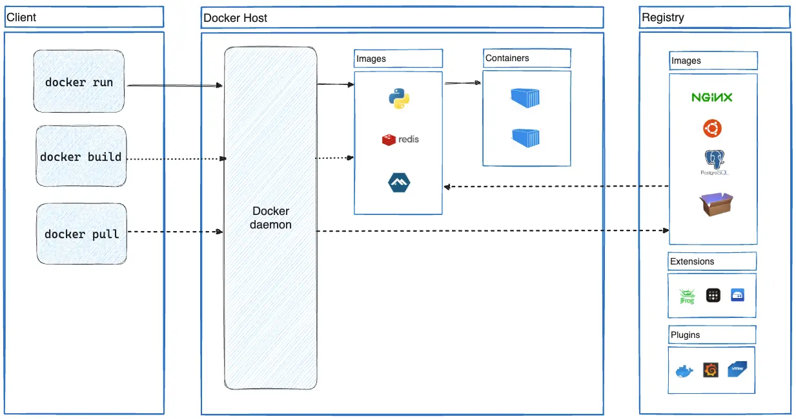

Конспект посвящён основам Docker: установке, командам и т.п. Применимо к Ubuntu 22.04. Теория, а конкретно "что такое Docker и для чего он нужен" — опускается.
<!--more-->

---
## Установка

Вечно актуальная документация: https://docs.docker.com/engine/install/ubuntu/

### Очистка перед установкой
Если уже стоит старая или неофициальная версия Docker или конфликтующие пакеты, нужно их удалить: `for pkg in docker.io docker-doc docker-compose docker-compose-v2 podman-docker containerd runc; do sudo apt-get remove $pkg; done`. При этом уже созданные образы и контейнеры не будут удалены. 

### Установка скриптом
Лучший вариант (субъективно). Работает для debian-based дистрибутивов Linux:
```bash
curl -fsSL https://get.docker.com -o get-docker.sh
sudo sh get-docker.sh
```

Если установка проходила этим способом, обновление Docker происходит обновлением пакетов: `sudo apt update && sudo apt upgrade`

### Установка через пакетный менеджер apt
```bash
# Add Docker's official GPG key:
sudo apt-get update
sudo apt-get install ca-certificates curl
sudo install -m 0755 -d /etc/apt/keyrings
sudo curl -fsSL https://download.docker.com/linux/ubuntu/gpg -o /etc/apt/keyrings/docker.asc
sudo chmod a+r /etc/apt/keyrings/docker.asc

# Add the repository to Apt sources:
echo \
  "deb [arch=$(dpkg --print-architecture) signed-by=/etc/apt/keyrings/docker.asc] https://download.docker.com/linux/ubuntu \
  $(. /etc/os-release && echo "${UBUNTU_CODENAME:-$VERSION_CODENAME}") stable" | \
  sudo tee /etc/apt/sources.list.d/docker.list > /dev/null
sudo apt-get update

# Install the latest version:
sudo apt-get install docker-ce docker-ce-cli containerd.io docker-buildx-plugin docker-compose-plugin

# Verify that the installation is successful:
sudo docker run hello-world
```

В таком случае обновиться можно командой `sudo apt-get install docker-ce docker-ce-cli containerd.io docker-buildx-plugin docker-compose-plugin`

### Удаление Docker
Удаление основных компонентов производится командой: `sudo apt-get purge docker-ce docker-ce-cli containerd.io docker-buildx-plugin docker-compose-plugin docker-ce-rootless-extras`

Удаление образов, контейнеров и т.д.: 
```bash
sudo rm -rf /var/lib/docker
sudo rm -rf /var/lib/containerd
```

Удаление остальных файлов:
```bash
sudo rm /etc/apt/sources.list.d/docker.list
sudo rm /etc/apt/keyrings/docker.asc
```

---
## Термины
**Docker Engine** — клиент-серверное ПО, которое содержит Docker Daemon, Docker Client (Docker CLI) и REST API — интерфейс для программного управления Docker. В общем-то Docker Engine это обычно то, что имеется в виду, когда говорят "Docker".

**Docker daemon** (демон) — фоновый процесс, который управляет Docker-объектами: сетями, образами, контейнерами и т.п.

**Docker client** (клиент) — инструмент для взаимодействия с Docker daemon через команды, такие как `docker run`, `docker build` и т.п, используя API

**Docker images** (образы) — шаблон в формате read-only с инструкциями для создания контейнера. Образы можно собрать с нуля, загрузить уже готовыми, либо (как это чаще всего бывает) собрать образ на основе другого (базового) образа. Инструкции для создания образа прописываются в специальном файле под названием **Dockerfile**. Образ собирается посредством наслоения, где каждый слой хранит информацию об изменениях состояния образа по сравнению с предыдущим слоем.

**Docker containers** (контейнеры) — запущенный экземпляр Docker образа. Каждый контейнер представляет из себя изолированную платформу для приложений.

**Docker registries** (реестр) — библиотека образов / директория, в которой хранятся образы. Реестр может быть как публичным, так и приватным, может храниться как локально, так и удалённо. Самым большим реестром образов Docker является **Docker Hub**.

**Docker Compose** — инструмент, который упрощает развёртывание приложений, для работы которых требуется несколько контейнеров Docker. Инструкции для Docker Compose описываются в файле `docker-compose.yml`.

---
## Устройство Docker

### Архитектура
Docker использует клиент-серверную архитектуру. Docker client общается с Docker daemon, который обслуживает тяжеловесную сборку, работу, а также размещение контейнеров. Демон и клиент Docker могут работать на одной системе или же клиент Docker может подключаться к удаленному Docker демону. Клиент и демон Docker взаимодействуют при помощи REST API, через UNIX сокеты или при помощи сетевого интерфейса.




Файлы, связанные с docker-контейнерами и образами хранятся в папке `/var/lib/docker`


### Устройство контейнеров
Образ является шаблоном контейнера, состоящим из нескольких неизменяемых слоёв. При создании контейнера создаётся верхний слой, который позволяет вносить изменения. Если пользователь пытается внести изменения в файлы слоёв образа, они копируются в верхний, и именно там происходят изменения.  
При удалении контейнера верхний слой, а значит и все изменения, удаляются.

### Устройство сетей
По-умолчанию создаются 3 сети: 
1. bridge — основная. В ней контейнеры получают свои IP-адреса, чтобы общаться между собой, а обращаться извне к ним можно через проброс портов.
2. host — использует сетевой интерфейс хоста. Убирает всю изоляцию между хостом и контейнером.
3. none — контейнер не получает сеть вообще, а значит у него нет доступа ни в интернет, ни к другим контейнерам.

Также есть и другие сети, например:
* overlay — создаёт виртуальную сеть между несколькими хостами, позволяя контейнерам с разных серверов общаться между собой, будто они в одной сети.
* macvlan — даёт контейнерам IP-адреса из подсети роутера, благодаря чему контейнеры выглядят как отдельные устройства в локальной сети.
* 3-rd party plugins — кастомные сети, такие как Weave, Calico и т.д.


Узнать, к какой сети принадлежит контейнер, можно с помощью команды `docker inspect <container>`


Иногда требуется, чтобы контейнеры работали в изолированной сети. Тогда можно воспользоваться командой `docker network create <net_name> --subnet 182.18.0.0/16`, которая создаст пользовательскую сеть типа bridge с заданным диапазоном IP-адресов.


Если контейнеры находятся в одной сети, они могут найти друг друга по имени, поскольку Docker имеет встроенный DNS-сервер


---
## Основные команды
Все команды для Docker начинаются с ключевого слова `docker`.
* `docker version` — вывод сведений о Docker;
* `docker login` — авторизация в реестре Docker;
* `docker system prune` — удаление неиспользуемых контейнеров, сетей и образов;

С версии 1.13 стали доступны более логически сгруппированные команды, такие как `docker container <command>`, `docker image <command>`, выполняющие те же функции. Так команда `docker container start` эквивалентна `docker start`, но является более понятной для пользователей (особенно новичков).

### Команды для контейнеров

Флаги команд должны быть прописаны до названия образа


Общая схема команд для управления контейнерами: `docker container <command>`, где вместо `<command>` вставляется:
* `create` — создание контейнера из образа.
* `commit` — создание нового образа из изменений в контейнере.
* `start` — запуск созданного контейнера.
* `run` — создание и запуск контейнера. Если образа для контейнера нет локально, Docker загрузит его из удалённого реестра.  
Флаги:
  * `-d` — запуск контейнера в фоновом режиме (detached mode), чтобы логи контейнера не выводились в хост;
  * `-t` — создание псевдотерминала для взаимодействия с приложением в контейнере;
  * `-i` — создание процесса, позволяющего перенаправлять потоковый ввод из хоста в приложение внутри контейнера;
  * `-p` — проброс портов;
  * `-v` — монтирование внешней директории;
  * `-e` — передача переменных окружения в контейнер;
  * `--name` — именование контейнера;
  * `--rm` — удаление контейнера после остановки;
  * `--entrypoint` — замена команды, задаваемой инструкцией `ENTRYPOINT`. Аргументы команды из `CMD` в этом случае не передаются;
  * `--network` — присвоение сети, в которой контейнер будет работать;
  * `--cpus=<num_of_CPU>` — ограничение в виде процессорной мощности, которую контейнер может использовать. num_of_CPU может быть дробным;
  * `--memory=<RAM>` — ограничение потребляемой контейнером памяти.
* `stop` — остановка работающего контейнера.
* `kill` — принудительная остановка работающего контейнера.
* `rm` — удаление <u>остановленного</u> контейнера.  
Флаги:
  * `-f` — принудительная остановка и удаление. Удаляет даже запущенные контейнеры.
* `ls` — вывод списка <u>запущенных</u> контейнеров. Эквивалентно `docker ps`.  
Флаги: 
  * `-a` — вывод список <u>всех</u> контейнеров (в том числе незапущенных);
  * `-s` — кроме прочего, вывод размера контейнера.
* `inspect` — вывод подробной информации о контейнере: переменные окружения, настройки сети, состояние и много чего ещё.
* `logs` — вывод логов.  
Флаги:
  * `-f` — вывод логов в реальном времени.
* `stats` — вывод текущего использования ресурсов запущенными контейнерами.
* `exec <container_id/name> <command>` — выполняет переданную команду `<command>` в запущенном контейнере.
* `attach` — подключение к запущенному контейнеру. С помощью этой команды можно просматривать вывод или вводить команды, если поддерживается. 


Перед тем, как удалить контейнер, нужно убедиться, что он неактивен


### Команды для образов
Общая схема команд для управления образами: `docker image <command>`, где вместо `<command>` вставляется:
* `build <path>` — сборка образа  
Флаги:
  * `-t` — именование образа.
* `rm` — удаление образа.
* `pull` — скачивание образа из реестра.
* `push` — отправка образа в удалённый реестр.
* `tag` — создание нового тега для существующего образа.
* `ls` — вывод списка образов. Эквивалентно `docker images`.
* `inspect` — вывод подробной информации об образе.
* `history` — вывод списка слоёв образа и их размеров.


Перед тем, как удалить образ, нужно убедиться, что все связанные с ним контейнеры удалены



Если при использовании команды требуется ввести id контейнера/образа, можно вводить его не полностью, а только несколько первых символов так, чтобы Docker мог однозначно доопределить id 


### Команды для сетей
Общая схема команд для управления сетями: `docker network <command>`, где вместо `<command>` вставляется:
* `create` — создание пользовательской сети.  
Флаги:
  * `-d` и `--driver` — указание на тип (драйвер) сети. Например, bridge;
  * `--subnet` — создание подсети с указанным IP-диапазоном;
  * `--gateway` — создание шлюза для сети, который контейнеры этой сети будут использовать для связи с внешними сетями.
* `rm` — удаление сети.
* `prune` — удаление всех неиспользуемых сетей.
* `connect <net> <container>` — подключение контейнера к существующей сети.
* `disconnect <net> <container>` — отключение контейнера от существующей сети.
* `ls` — вывод списка сетей.
* `inspect` — вывод подробной информации о сети, в которой находится контейнер.

---
## Подробнее про `docker run`

Чтобы загрузить образ и запустить контейнер, как мы уже знаем, нужно прописать `docker run`. Например, чтобы загрузить официальный образ redis и запустить контейнер на его базе, пишут `docker run redis`. 

Если требуется специфическая версия (по умолчанию latest-последняя), то нужно указать её **тег** через разделитель ":": `docker run redis:6.0`.

Если требуется взаимодействовать с контейнером при запуске, нужно прописать комбинацию флагов `-it`.

Чтобы выполнить какую-либо команду в контейнере при его запуске, можно прописать её после имени образа. Так, команда `docker run alpine:3.8 cat /etc/*rel*` выведет информацию об ОС в терминал хоста.

### Проброс портов
Допустим, бд работает на дефолтном 3306 порту. Чтобы иметь возможность обращаться к ней из внешнего мира, нужно сопоставить этот порт с каким-либо свободным портом хоста: `docker run -p 54100:3306 mysql`. Таким образом, когда мы будем обращаться к IP нашего сервера по 54100 порту, нас будет перенаправлять в 3306 порт контейнера.

### Монтирование директорий
Предположим, нужно, чтобы данные из контейнера по пути /var/lib/mysql сохранились даже после удаления контейнера. Это можно осуществить, если связать папку контейнера с папкой хоста: `docker run -v /opt/datadir/:/var/lib/mysql mysql`, где часть после флага и перед двоеточием — путь папки в хосте.

---
## Dockerfile

В файлах Dockerfile содержатся инструкции по созданию образа. Инструкции обозначаются заглавными буквами, а после них идут аргументы.  

Согласно документации, слои создаются только инструкциями `FROM`, `RUN`, `COPY` и `ADD`, но это не совсем так. Слои создаются любыми инструкциями, но слои, созданные не перечисленными, будут весить 0 байт.

### Инструкции
|Instruction|Purpose|
|:--:|:--|
|`FROM`|Создаёт базовый образ. Первая инструкция в любом Dockerfile.|
|`RUN`|Выполняет команду и создаёт слой. Используется для установки пакетов в контейнер, создания файлов и т.п.|
|`ADD`|Копирует в контейнер файлы и директории из хоста. Помимо этого умеет распаковывать архивы и загружать файлы по URL.|
|`COPY`|Копирует в контейнер файлы и директории из хоста. Рекомендуется использовать вместо `ADD`, если не требуется дополнительный функционал.|
|`WORKDIR`|Задаёт рабочую директорию для дальнейших инструкций. Если директории не существует, она будет создана.|
|`VOLUME`|Объявляет точки монтирования для хранения данных вне контейнера.|
|`ENV`|Устанавливает постоянные переменные окружения, которые будут доступны в контейнере во время его работы.|
|`EXPOSE`|Информирует о портах, которые контейнер будет слушать во время работы. Служит лишь справочной информацией, а не действием.|
|`ARG`|Задаёт переменные для передачи Docker во время сборки образа.|
|`CMD`|Определяет команду с аргументами, которая будет выполнена по умолчанию при запуске контейнера. Если в одном Dockerfile несколько инструкций `CMD`, выполнится только последняя. Может быть переопределена, если контейнер запускается с аргументами: `docker run <image> <new_command>`.|
|`ENTRYPOINT`|Определяет команду с аргументами, которая будет выполнена по умолчанию при запуске контейнера. Не может быть переопределена обычным образом. Если при запуске контейнера передаётся команда, она идёт в качестве аргумента в `ENTRYPOINT`.|
|`LABEL`|Добавляет метаданные в образ.|

Часто `ENTRYPOINT` и `CMD` используют вместе. В этом случае аргументы инструкции `CMD` становятся аргументами команды, заданной инструкцией `ENTRYPOINT`. 

Помимо этого, команды в `ENTRYPOINT` и `CMD` могут быть написаны в виде:
* shell-команды. Например, `CMD sleep 5`
* json-массива. Например, `CMD ["sleep", "5"]`

И-так, если нужна команда по умолчанию при запуске контейнера, имеющая значения по умолчанию, которое можно переопределить, можно воспользоваться следующей последовательностью инструкций:
```dockerfile
ENTRYPOINT ["sleep"]
CMD ["5"]
```
Таким образом, если выполнить команду `docker run <image> 10`, контейнер запустится с командой `sleep 10`. Если ничего не передавать в качестве аргументе, с командой `sleep 5`


При выполнении инструкций, если это возможно, лучше писать несколько команд под одной инструкцией, например: `RUN apk update && apk upgrade && apk add bash`. Таким образом создаётся только один слой вместо трёх, что уменьшает как размер образа, так и скорость разворачивания контейнера.


Dockerfile может выглядеть, к примеру, так:

```dockerfile
# Задаём базовый образ
FROM python:3.7.2-alpine3.8
# Помечаем контактные сведения создателя
LABEL maintainer="obsidian@gmail.com"
# Устанавливаем зависимости
RUN apk add --update git
# Задаём текущую рабочую директорию
WORKDIR /usr/src/my_app_directory
# Копируем код из локального контекста в рабочую директорию образа
COPY . .
# Задаём значение по умолчанию для переменной
ARG my_var=my_default_value
# Настраиваем команду, которая должна быть запущена в контейнере во время его выполнения
ENTRYPOINT ["python", "./app/my_script.py", "my_var"]
# Открываем порты
EXPOSE 8000
# Создаём том для хранения данных
VOLUME /my_volume
```

---
## Docker Compose

**Docker Compose** — это инструмент для запуска мульти-контейнерных приложений. Инструкции для него описываются в файле `docker-compose.yml`.

Есть две версии Docker Compose. Первая (v1) — устаревшая, запускается командой `docker-compose`. Вторая (v2) — предпочтительна к использованию, запускается командой `docker compose` (интегрирована в Docker CLI). 


Дальнейшие описания касаются Docker Compose v2, использующего yaml с синтаксисом v3


### docker-compose.yml
Файл docker-compose.yml состоит из блоков/разделов. Рассмотрим на примере:

```yaml
# Обычно файлы начинаются с тега версии синтаксиса
# Поле является информативным
version: "3.8"

# 1 сервис = 1 контейнер
# Каждый сервис задаётся именем и набором параметров
services:
  web:
    # Использует уже собранный образ
    image: nginx:1.27
    # Проброс портов
    ports:
      - "80:80"
    # Присваивает сервис сети
    networks:
      - new_network
  db:
    # Собирает новый образ по заданному пути
    build: ./db
    # Задаёт переменные окружения
    environment:
      POSTGRES_USER: user
      POSTGRES_PASSWORD: pass
    # Монтирует директории
    volumes: db_data:/var/lib/postgresql/data
    networks:
      - new_network

# Создаёт сеть для взаимодействия между контейнерами
networks:
  new_network
```

### Команды Docker Compose
1. `docker compose up` — создание и запуск контейнеров, следуя инструкции из файла `docker-compose.yml`.  
Флаги:
  * `-d` — запуск контейнеров в фоновом режиме (detached mode), чтобы логи не выводились в хост;
  * `--build` — сборка образов, если присутствуют инструкции `build:`.
2. `docker compose stop` — остановка контейнеров без удаления созданных примитивов (образов, контейнеров и т.п., созданных Docker Compose).
3. `docker compose down` — остановка контейнеров с последующим удалением созданных примитивов.
4. `docker compose ps` — вывод списка контейнеров, запущенных с помощью Docker Compose.
5. `docker compose logs` — вывод логов всех запущенных контейнеров.