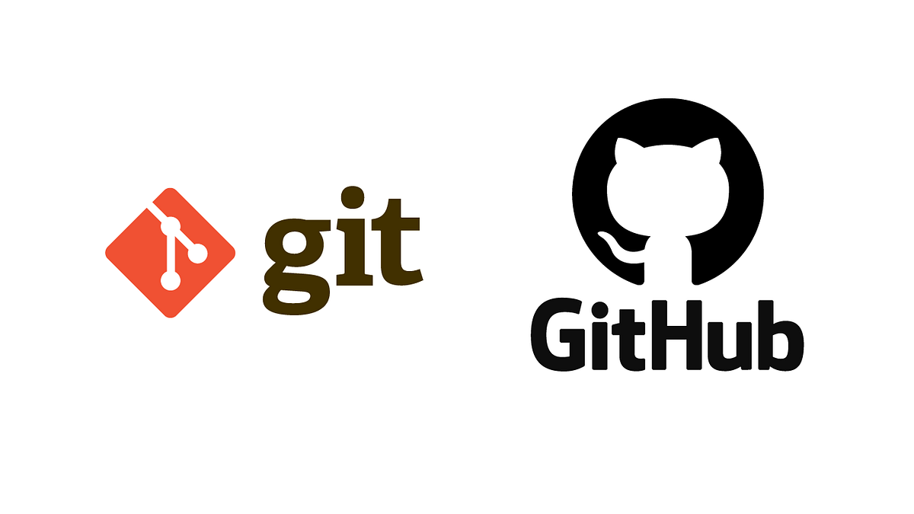
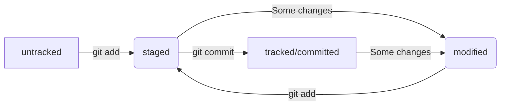

Конспект посвящён основам работы с распределённой системой контроля версиями (Git).
<!--more-->

## О Git
Git — система контроля версий, которая помогает отслеживать изменения в проекте. Он позволяет сохранять изменения локально и при необходимости возвращаться к предыдущим версиям проекта.

Все файлы, связанные с контролем версий (ну почти все), находятся в директории `/.git`.

### Состояния
Файлы в Git могут быть в четырёх состояниях: untracked (неотслеживаемый), tracked (отслеживаемый), staged (подготовленный) и modified (изменённый)



В некоторых случаях файл может быть в статусах `staged` и `modified` одновременно (вернее было бы сказать, что разные версии этих файлов находятся в разных статусах).

### Лог и хэш коммита
Хеш — основной идентификатор коммита. Он позволяет узнать его автора, дату и содержимое закоммиченных файлов. Все хеши, а также таблицу соответствий `хеш → информация о коммите` Git хранит в папке `.git`.  

### HEAD
Файл `HEAD` — один из служебных файлов папки `.git`. Он указывает на последний коммит или на ветку, которая, в свою очередь, указывает на последний коммит. Внутри `HEAD` — ссылка на служебный файл: `refs/heads/main`. Если заглянуть в этот файл, можно увидеть хеш последнего коммита.

### Сообщения к коммитам
Сообщения должны быть:
- Относительно короткими
- Информативными
- На английском языке
- Начинаться с заглавной буквы
- В повелительном наклонении
- В одном стиле

### .gitignore
Файл `.gitignore` нужен, чтобы `Git` не добавлял в репозиторий файлы, указанные в этом файле (файлы останутся "untracked"). В `gitignore` можно указать названия файлов, которые не нужны в репозитории. Внутри поддерживаются регулярные выражения.

Небольшой шаблон `.gitignore` для Python-проекта: 
```
# Byte-compiled
__pycache__/
*.py[cod]

# Environments
venv/
.env

# Distribution / packaging
dist/
*.egg-info/

# Unit test / coverage reports
.coverage
*.py,cover
.cache/

# Jupyter Notebook
.ipynb_checkpoints
```

---
## Работа с Git

### Создание репозитория
`git init` — Инициализация локального репозитория.

### Настройки
```bash
git config --global user.name "Ivan Ivanov"   # Настройка имени пользователя
git config --global user.email "user@example.gmail"  # Настройка почты пользователя
```

Этими параметрами будут подписываться коммиты


### Работа с коммитами и индексами
```bash
git add <file_name>  # Добавить в индекс указанный файл
git add .            # Добавить в индекс все файлы текущей директории и её поддиректорий

git restore <file_name>           # Отменить изменения файла file_name
git restore --staged <file_name>  # Убрать файл из индекса

git commit --amend --no-edit            # Добавить изменения к последнему коммиту и оставить сообщение прежним
git commit --amend -m "Новое сообщение" # Изменить сообщение к последнему коммиту
git reset --soft <commit_hash>          # Отмена коммита с оставлением изменений в staged
git reset --mixed <commit_hash>         # Отмена коммита и убираем изменения из staged, не редактируя файлы
git reset --hard <commit_hash>          # Отмена коммита со сбросом изменений в файлах

git log           # Вывести подробную информацию о коммитах
git log --oneline # Вывести сокращённый хэш и комментарий коммита
```

### Просмотр изменений
```bash
git diff                              # Вывести изменения файлов в статусе modified
git diff <commit_hash> <commit_hash>  # Вывести изменения (разницу) между двумя коммитами
git diff --staged                     # Вывести изменения, имеющиеся в staged-файлах
git diff <branch_name> <commit_hash>  # Вывести разницу между веткой branch_name и указателем на HEAD
git diff HEAD~2 HEAD                  # Вывести разницу между последним коммитом и тем, который был два назад
```

### Клонирование репозитория
`git clone git@github.com:<USERNAME>/<REPONAME>.git` — клонирует удалённый репозиторий на локальный хост и связывает их, если этот удалённый репозиторий принадлежит пользователю хоста.

### Работа с ветками
```bash
git branch                           # Вывести список веток в репозитории
git branch -a                        # Вывести список веток в локальном и связанном с ним удалённом репозитории
git branch <name>                    # Создание ветки с именем name
git branch -d <name>                 # Удалить ветку name, если она является частью main
git branch -D <name>                 # Удалить ветку name
git branch -m <name>                 # Переименовать ветку в name
git branch -m <old_name> <new_name>  # Переименовать ветку с old_name в new_name

git checkout <name>     # Перейти на ветку name
git checkout -b <name>  # Создать ветку name и перейти в неё

git merge <name>            # Объединить активную ветку с веткой name
git merge --no-edit <name>  # Объединить активную ветку с веткой name, при этом отключить ввод сообщения
git merge --no-ff <name>    # Отключить fast-forward слияние веток

git rebase <branch_name>    # Переместить коммиты активной ветки в конец ветки branch_name
```

### Работа с удалёнными репозиториями
```bash
git fetch origin                # Загрузить все изменения из удалённого репозитория
git fetch origin <branch_name>  # Загрузить все изменения определённой ветки из удалённого репозитория

git pull  # Подтянуть изменения активной ветки из удалённого репозитория (`git fetch` + `git merge`)

git push -u origin <branch_name>  # Отправить новую ветку в удалённый репозиторий и связать локальную с удалённой
git push <branch_name>            # Отправить изменения в ветку branch_name, уже существующую в удалённом репозитории
git push --force                  # Принудительно отправить изменения, при необходимости перезаписав историю
```

### Прочие команды  
`git version` — показывает версию Git;  
`git config` — нужна для просмотра и изменений настроек Git;  
`git status` — выводит в консоль статусы файлов в локальном репозитории;  
`git status --ignored` — выводит в консоль статусы файлов, в том числе игнорируемых;  
`git remote -v` — выводит информацию о том, связан ли локальный репозиторий с удалённым;  
`git mergetool` — открывает vimdiff (по умолчанию) — инструмент для разрешения конфликтов.

---
## Алгоритмы

### Коммит-пуш  
Типичный алгоритм коммита-пуша:
```bash
git pull                   # Подтягивание изменений для активной ветки из удалённого репозитория (дабы избежать конфликтов версий)
git add .                  # Добавление файла в индекс
git commit -m "<comment>"  # Сохранение файла
git push                   # Отправка сохранённых изменений в удалённый репозиторий
```

### Привязка удалённого репозитория
Алгоритм создания и привязки удалённого репозитория:
* Создать удалённый репозиторий в GitHub
* Сгенерировать SSH-ключ (если ещё нет):
    ```bash
    ssh-keygen -t ed25519 -C "электронная почта, к которой привязан аккаунт на GitHub"
    ```
* Копировать открытый ключ командой `cat ~/.ssh/id_ed25519.pub`
* Добавить созданный ключ на GitHub
* **Привязать удалённый репозиторий** командой `git remote add origin <ссылка_на_удалённый_репозиторий>` или клонировать его командой `git clone <ссылка_на_удалённый_репозиторий>` и убедиться, что репозитории связаны: `git remote -v`  
В выводе должно быть:
    ```bash
    origin    git@github.com:%ИМЯ_АККАУНТА%/%ИМЯ-ПРОЕКТА%.git (fetch)
    origin    git@github.com:%ИМЯ_АККАУНТА%/%ИМЯ-ПРОЕКТА%.git (push) 
    ```

### Форк репозитория
Форк — создание копии репозитория в GitHub. В процессе форка создаются копии всех файлов, веток и истории коммитов.

Чтобы сделать форк, нужно нажать на соответствующую кнопку в репозитории проекта:


Теперь репозиторий можно клонировать локально, вносить необходимые изменения и отправлять их.

### Создание ветки и слияние с основной
Допустим, в работающий проект нужно добавить новые функции. Для этого лучшей практикой считается создание новой ветки, в которой будет проходить разработка и тестирование. Если изменения удачны, их заливают в релиз путём объединения веток.  
Посмотрим на алгоритм подобных действий:
1. Создать ветку и перейти в неё: `git checkout -b dev`;
2. Выполнить необходимые коммиты;
3. Протестировать;
4. Перейти в главную ветку и слить её с главной: `git checkout main && git merge dev`. При этом обе ветки теперь будут указывать на последний коммит ветки `dev`;
5. Удалить второстепенную ветку (она должна быть неактивной): `git branch -d dev`;
6. Запушить изменения, удалив ветку и в удалённом репозитории: `git push origin --delete dev`.

### Pull request
Pull request — запрос на изменения. Его используют, чтобы предложить свои улучшения по проекту. PR могут как принять, т.е. слить с веткой оригинального проекта, так и отклонить. Важно также понимать, что pull request — фича GitHub (и ему подобных), а не Git.

Чтобы создать PR, можно следовать алгоритму: 
1. Создать форк репозитория;
2. Клонировать локально;
3. Связать с оригинальным репозиторием, чтобы отслеживать изменения: `git remote add <имя_привязки> <ссылка_на_удалённый_репозиторий>` -> `git fetch <имя_привязки>`
4. Создать новую ветку: `git branch <branch_name>`;
5. Выполнить необходимые изменения;
6. Протестировать;
7. Запушить;
8. Перейти в <u>свой</u> удалённый репозиторий -> Pull requests -> New pull request. Выбрать ветки: из какой и в какую пойдёт предложение изменений. -> Create pull request -> Заполнить поля -> повторно Create pull request.

Теперь на вкладке Files changed можно обсуждать изменения и делать ревью. Также можно в любой момент добавить дополнительные коммиты в ветку — они автоматически попадут в открытый pull request после пуша.

Если изменения подходят, владельцу оригинального репозитория достаточно нажать "Merge pull request", чтобы объединить ветки.

### Разрешение конфликта
1. Открыть конфликтный файл в IDE или mergetool: `git mergetool <file_name>` и разрешить конфликт;
2. Сделать коммит — он завершит процесс слияния веток.