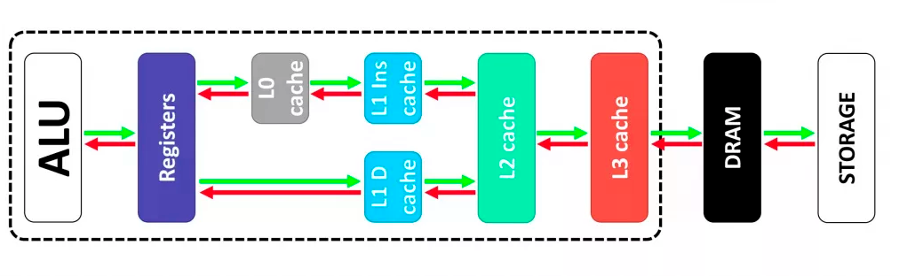

Конспект посвящён объяснению понятия компьютерной памяти и тому, как эта память устроена в языке программирования Python
<!--more-->
## Компьютерная память

Как можем видеть из схемы ниже, память в компьюетере разделяется на **внутреннюю** и **внешнюю**:


Посмотрим подробнее на каждый тип памяти.

---
### Внутренняя память
Характерными особенностями внутренней памяти по сравнению с внешней являются высокое быстродействие и ограниченный объем. Физически внутренняя память компьютера представляет собой интегральные микросхемы, которые размещаются в специальных гнездах на материнской плате. Чем больше размер внутренней памяти, тем более сложную задачу и с большей скоростью может решить компьютер.

Внутренняя память подразделяется на:
* постоянную память
* оперативную память
* кэш-память

**Постоянная память** (ROM — read-only memory) — энергозависимая память, использующаяся для долговременного хранения неизменяемого массива данных. Содержание ПЗУ специальным образом закладываестя при его изготовлении для постоянного хранения. Из название как раз можно понять, что данная память предназначена только для чтения.

**Оперативная память** (RAM — Random Access Memory) — в большинстве случаев энергозависимая память, хранящая выполняемый машинный код программ, входные, выходные и промежуточные данные, обрабатываемые процессором в текущем сеансе работы ПК. После выключения питания компьютера, полностью очищается.

Микросхемы оперативной памяти монтируются на печатной плате. Каждая такая плата снабжена контактами, расположенными вдоль нижнего края. Для подключения к другим устройствам компьютера такая плата вставляется своими контактами в специальный разъем (слот) на материнской плате. Материнская плата имеет несколько разъемов для модулей оперативной памяти, суммарный объем которых может принимать ряд фиксированных значений, например 2, 4, 8, 16, 32 Гб и более.

Оперативная память бывает нескольких типов: SDRAM, DDR, DDR2, DDR3, DDR4, DDR5. Каждый последующий тип памяти представляет собой улучшение предыдущего и позволяет новой памяти работать с большей скоростью. В данный момент в современных компьютерах используется оперативная память типа DDR4 и DDR5.

**Кэш-память** (cache) — промежуточный буфер с быстрым доступом к нему, содержащий информацию, которая может быть запрошена с наибольшей вероятностью. Эта память испольлзуется при обмене данными между процессором и оперативной памятью. Алгоритм ее работы позволяет сократить частоту обращений процессора к оперативной памяти и, следовательно, повысить производительность компьютера.

Современные процессоры оснащены кэшем, который состоит зачастую из трех уровней: L1 (первый уровень), L2 (второй уровень), L3 (третий уровень). 

* **L1** — наиболее быстрый уровень кэш-памяти, который работает напрямую с ядром процессора, в следствии чего обладает наименьшим временем доступа и работает на частотах, близких процессору. Размер данного кэша обычно не велик, а количество микросхем зачастую привязано к количеству ядер процессора, при этом у каждого ядра кэш свой собственный. Размер блока может варьироваться от 64-256 КБ у десктопов и ноутбуков до 1-2 МБ для серверных решений.

    Сам L1 тоже имеет свое разделение. Он делится на кэш команд и кэш данных:

    - Первый содержит информацию об операции, которой занимается ЦП, проще говоря, отвечает на вопрос: «Что надо сделать»;

    - Второй хранит в себе данные, над которыми должны производиться вычисления.

* **L2** — второй уровень более масштабный, нежели первый, но в результате, обладает меньшими скоростными характеристиками. Также привязан к ядру и не взаимодействует с остальными.

* **L3** — третий уровень. Он более медленный, нежели два предыдущих, но всё же гораздо быстрее, чем оперативная память. Этот блок уже доступен для всех ядер процессора. На третьем уровне временно хранятся данные, которые хоть и важны для продуктивной работы, но регистры обращаются за этой информацией относительно нечасто.



---
### Внешняя память
Назначение внешней памяти компьютера заключается в долговременном хранении информации любого вида. Выключение питания компьютера не приводит к очистке внешней памяти и её объём в тысячи раз больше объёма внутренней памяти. Минус такой памяти в том, что обращение к ней требует гораздо большего времени.

К устройствам внешней памяти относятся:
* Жёсткие магнитные диски (HDD — Hard Disk Drive)
* Твердотельные накопители (SSD — Solid State Drive)
* Оптические диски (CD-ROM, DVD-ROM, Blue-Ray и т.д.)
* Флеш-накопители
* Гибкие магнитные диски

Наиболее распространенный вариант постоянной памяти — жесткие диски HDD. Они представляют собой один или несколько магнитных дисков, вращающихся с огромной скоростью (от 5 до 12 тысяч оборотов в минуту), и головок, предназначенных для считывания и записи информации. HDD являются надежными носителями информации, позволяют записывать и считывать информацию огромное количество раз. Неудобство в том, что они очень медленные и восприимчивы к ударам, падениям и прочим механическим воздействиям, особенно в момент работы.

Почти у каждого уверенного пользователя ПК в наши дни скорее найдётся SSD, чем HDD. Их популярность неудивительна, ведь они имеют гораздо более высокую скорость записи и чтения и невосприимчивы к механическим воздействиям. Их можно было бы назвать идеальными накопителями, если бы не ощутимо конечное количество циклов чтения-записи.

## Управление памятью в Python
Управление памятью — это процесс выделения, распределения и координации памяти таким образом, чтобы все программы работали правильно и могли оптимально получать доступ к различным системным ресурсам. Управление памятью также включает в себя и очистку памяти от объектов, которые больше не нужны.

Существует два типа управления памятью: ручное и автоматическое.

Ручное управление включает в себя, как правило, три этапа:
1. Запрос памяти у операционной системы
2. Работа с ней
3. Возвращение памяти обратно в операционную систему

Ручной подход управления (как в C, C++, Pascal и т.д.) позволяет работать с памятью максимально эффективно. Программист точно знает, сколько памяти ему выделено, зачем он её использует, и т.д. Однако помимо преимуществ такой подход имеет и ряд недостатков. Ключевой из них — сложность. Управлять памятью вручную — сложно и тяжело, поскольку легко забыть вернуть память обратно операционной системе, в результате чего возникает утечка: программа держит неиспользуемую память просто так, не давая применять ее для решения других задач.

Автоматическое управление памятью (как в Python, Java, JS, C#, Ruby и т.д.) берет на себя самый сложный этап — возвращение памяти обратно операционной системе, когда она уже не требуется. Восстановленная память может использоваться другими объектами. В определённых случаях это менее эффективно, но позволяет сильно сократить трудозатраты и повысить надежность процесса.

Python — это язык с автоматическим управлением памятью. Причем для управления ею он использует несколько механизмов. При запуске Python программы создается новый процесс, в рамках которого операционная система выделяет пул ресурсов, включая виртуальное адресное пространство. В эту память загружается интерпретатор Python вместе со всеми необходимыми ему для работы данными, включая код написанной программы.

Оставшаяся свободная виртуальная память может использоваться для хранения информации об объектах Python. Для управления этой памятью в CPython используется специальный механизм, который называется аллокатор. Он используется каждый раз, когда вам нужно создать новый объект.

Обычно мы в своих программах не оперируем большими объектами. Большая часть наших данных — это числа, строки и т.д., они занимают не такой уж большой объем в расчёте на одно значение. Но зато мы создаем их достаточно часто. И это приводило бы к проблемам, если бы Python абсолютно все такие вызовы транслировал в операционную систему. Системный вызов на выделение памяти — штука трудозатратная, зачастую связанная с переходом в контекст ядра операционной системы. Поэтому одна из главных задач аллокатора Python — оптимизация количества системных вызовов.


Для больших объектов (больше 512 байт) Python выделяет память напрямую у ОС. Обычно таких объектов не очень много в рамках программы, и создаются они нечасто. Поэтому накладные расходы на создание таких объектов напрямую в RAM не так высоки.


Аллокатор для малых объектов (не больше 512 байт) использует три уровня абстракции:
* Блок — кусок памяти, используемый для хранения одного объекта.
* Пул — страница памяти, содержащий блоки (обычно 4 килобайта).
* Арена — большой непрерывный кусок памяти, содержащий пулы (обычно 256 килобайт).


#### Блок
Блок — это кусок памяти, который может содержать только один Python объект фиксированного размера. Размер блока может варьироваться от 8 до 512 байт и должен быть кратен восьми. Все блоки в конкретном пуле имеют одинаковый размер и находятся в одном классе размера, который и определяет размер блока. 

|Запрос памяти в байтах|Размер блока в байтах|Индекс класса размера|
|:--:|:--:|:--:|
|1-8|8|0|
|9-16|16|1|
|17-24|24|2|
|25-32|32|3|
|33-40|40|4|
|41-48|48|5|
|...|...|...|
|505-512|512|63|

Таким образом, если необходимы:
* 6 байт, то данные будут помещены в блок размером 8 байт;
* 42 байта, то данные будут помещены в блок размером 48 байт;
* и т.д.

#### Пул
Пулы состоят из блоков одного размера. Каждый пул работает по принципу двухсвязного списка с другими пулами того же размера, поэтому алгоритм может с легкостью найти необходимое место для требуемого размера блока даже среди множества пулов. Размер пула равен 4 килобайта.


Ограничение пула фиксированным размером блоков помогает с фрагментацией. Если объект уничтожается, аллокатор может заполнить это пространство новым объектом того же размера.


Для эффективного управления пулами Python использует дополнительный список, который называется `usedpools`. Он хранит указатели на пулы, сгруппированные по классам. Как уже известно, все пулы с одинаковым размером блока связаны между собой с помощью двухсвязного списка. Чтобы перебрать их, нужно просто знать начало списка. Если пулов такого размера нет, то при первом запросе памяти будет создан новый.

Пулы находятся в трех состояниях:
* Используемый (used) — частично заполненный, какие-то блоки заняты, какие-то свободны;
* Полный (full) — полностью заполненный, все блоки заняты;
* Пустой (empty) — все блоки свободны и доступны для записи (хранятся в списке пустых пулов `freepools`).

Используемый пул содержит блоки, в которые можно записать какую-то информацию. Блоки полного пула все распределены и уже содержат данные. Пустые пулы не содержат данных и могут быть разбиты на какие угодны классы размера при необходимости.

Допустим, нашему коду необходимо 8 байт. Если в списке используемых пулов нет пулов с классом размера в 8 байт, то новый пустой пул инициализируется, как хранящий блоки по 8 байт. Затем пустой пул добавляется в список используемых пулов и может быть использован при следующих запросах.

Заполненный пул освобождает некоторые блоки, когда эта информация в них уже не нужна. Этот пул добавится в список используемых в соответствии со своим классом размера.


Пулы и блоки не выделяют память напрямую, вместо этого они используют уже выделенное пространство в аренах.


#### Арены
Арена – это кусок памяти размером в 256 килобайт, который обеспечивает память для 64 пулов.

Арены, в отличие от пулов, не имеют явных разделений на состояния. Они сами по себе организованы в двухсвязный список `usable_arenas`, который отсортирован по количеству свободных пулов. Чем меньше свободных пулов, тем ближе арена к началу списка. 


Поэтому наиболее полная арена будет выбрана для записи еще большего количества данных. Такое расположение арен позволяет снизить объем потребляемой программой памяти. Дело в том, что в некоторых случаях, когда память освобождается, она все еще остается недоступной операционной системе. Процесс Python держит ее распределенной и использует ее позже для новых данных. Полное освобождение памяти возвращает память в пользование операционной системе.

Арены — единственные области, которые могут быть полностью освобождены. Таким образом мы понимаем, что те арены, которые находятся в списке ближе к пустому состоянию, должны быть освобождены. В таком случае, область памяти может быть действительно полностью освобождена, и соответственно общий объем памяти Python программы будет уменьшен.

## Очистка памяти

Как мы уже знаем, язык Python является языком с автоматически управляемой памятью, то есть программисту, пишущему код на Python, не нужно беспокоиться о работе с памятью, в частности заниматься ее освобождением. Как только данные программы (объекты в Python) больше не нужны, Python автоматически освобождает память, которую они занимали. Несмотря на это, понимание того, как работает механизм очистки памяти, может помочь писать более качественный и производительный код.

Стандартный интерпретатор Python использует сразу два механизма очистки памяти:
* Подсчёт ссылок;
* Сборщик мусора (Garbage Collector, GC).

### Подсчёт ссылок
Алгоритм подсчета ссылок — это один из самых простых механизмов очистки памяти. Объекты удаляются как только на них больше нет ссылок.

Каждый объект в Python унаследован от базового класса PyObject, который содержит специальное поле `Reference Count (ob_refcnt)`, в котором хранится количество ссылок на данный объект. Как только кто-то начинает ссылаться на объект, значение этого поля увеличивается на единицу. Если по какой-то причине ссылка пропадает, то это поле уменьшается на один. При этом если счетчик ссылок для определенного объекта достигает нуля, то интерпретатор запускает процесс уничтожения объекта. Если удаленный объект содержал ссылки на другие объекты, то эти ссылки также удаляются. Таким образом, удаление одного объекта может повлечь за собой удаление других.


Механизм подсчета ссылок работает в режиме реального времени.


Четыре основных сценария, увеличивающих количество ссылок на объект:
* Создание нового объекта и присвоение его переменной;
* Присвоение уже существующего объекта переменной;
* Передача объекта в функцию в качестве аргумента;
* Добавление объекта в список, множество, словарь и т.д.

Четыре основных сценария, уменьшающих количество ссылок на объект:
* Удаление объекта из области видимости функции после ее завершения;
* Удаление переменной с помощью оператора del;
* Переприсваивание переменной нового значения;
* Удаление объекта из списка, множества, словаря и т.д.

Для получения количества ссылок на заданный объект используется функция `getrefcount()` из модуля `sys`. 
```py
import sys

nums = [1, 2, 3] 

print(sys.getrefcount(nums))

# Вывод: 2
```

Когда мы вызываем функцию `getrefcount()` для получение количества ссылок на объект, мы увеличиваем количество ссылок на объект на один, так как передаем `nums` в качестве аргумента в функцию. Поэтому счетчик ссылок равен 2. Это означает, что и переменная `nums`, и функция `getrefcount()` ссылаются на один и тот же список `[1, 2, 3]`.

Алгоритм подсчета ссылок очень простой и эффективный, но у него есть один большой недостаток. Он не умеет определять циклические ссылки. Приведённый ниже код создаёт циклические ссылки, так как `nums1` содержит ссылку на `nums2`, в то время как `nums2` содержит ссылку на `nums1`. Таким образом, счетчики ссылок у `nums1` и `nums2` никогда не будут равны нулю.
```py
nums1 = [1, 2, 3]
nums2 = [4, 5]

nums1.append(nums2)
nums2.append(nums1) 
```

Именно из-за этого в Python существует дополнительный механизм очистки памяти — сборщик мусора (Garbage Collector, GC), который следит за объектами с потенциальными циклическими ссылками.


В Python алгоритм подсчета ссылок является фундаментальным и не может быть отключен, тогда как сборщик мусора (GC) опционален и может быть отключен.


Количество ссылок на определенный объект иногда может оказаться заметно больше, чем кажется на первый взгляд. Дело в том, что многие неизменяемые объекты уже используются, например, в реализациях встроенных функций и типов данных. Объекты, относящиеся к изменяемым типам данных данной особенности не подвержены, так как изменение такого объекта в одной части программы привело бы к его изменению в другой части программы.
```py
import sys

print(sys.getrefcount(0))     # число 0
print(sys.getrefcount(1))     # число 1
print(sys.getrefcount(''))    # пустая строка
print(sys.getrefcount(()))    # пустой кортеж
```

```
# Возможный вывод:
164
84
58
1257
```

Счетчик ссылок подвержен проблемам в многопоточной среде, которые могут приводить к некорректности обновления этого счетчика из разных потоков и, следовательно, к удалению объектов, на которые еще существуют ссылки. Чтобы этого избежать, CPython использует GIL — Global Interpreter Lock. Каждый раз, когда происходит работа с памятью, GIL — как глобальная блокировка — препятствует выполнению этих действий одновременно из двух потоков. Он гарантирует, что сначала отработает один, потом другой.

---
### Сборщик мусора
В отличие от алгоритма подсчета ссылок, сборщик мусора не работает в режиме реального времени и запускается периодически. Каждый запуск сборщика создаёт микропаузы в работе программы, поэтому Python использует различные эвристики для определения частоты запуска сборщика мусора.

Сборщик мусора разделяет все объекты на 3 поколения (нулевое, первое и второе). Новые объекты попадают в нулевое поколение. Если новый объект выживает в процессе сборки мусора, то он перемещается в следующее поколение. Чем старше поколение, тем реже оно сканируется на сборку мусора. Так как новые объекты зачастую имеют очень маленький срок жизни (являются временными), то имеет смысл проверять их чаще, чем те, которые уже прошли через несколько этапов сборки мусора.

В каждом поколении есть специальный порог срабатывания, при достижении которого срабатывает процесс сборки мусора. Если сразу несколько поколений преодолели порог, то выбирается наиболее старшее поколение, так как сборка мусора в старших поколениях включает в себя также сборку мусора и в младших поколениях.

---

**Основной источник:** https://stepik.org/course/82541/syllabus

Дополнительные источники: 
* [Habr](https://habr.com/ru/companies/domclick/articles/530804/)  
* [Market.Marvel.ru](https://market.marvel.ru/blog/komplektuyushchie-i-optsii/kesh-pamyat-protsessora/)  
* [GitHub](https://github.com/python/cpython/blob/7d6ddb96b34b94c1cbdf95baa94492c48426404e/Objects/obmalloc.c)