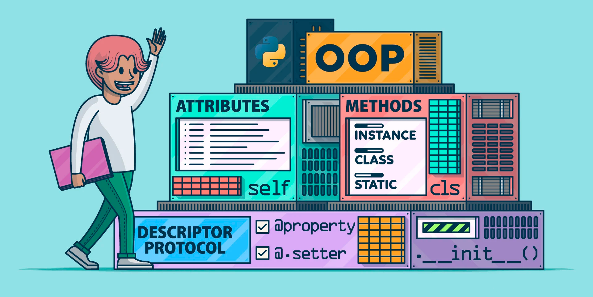

Конспект посвящён основам и принципам ООП в Python
<!--more-->

## Процедурное программирование vs ООП

В программировании самыми популярными подходами к написанию программ являются **процедурный** и **объектно-ориентированный**. 

В языках, в основе работы которых лежит подход процедурного программирования (C, Pascal, BASIC), главным является код для обработки данных. При этом сами данные имеют второстепенное значение. Процедура — это независимая именованная часть программы, которую после однократного описания можно многократно вызвать по имени из последующих частей программы для выполнения определенных действий. Процедура может рассматриваться просто как функция, которая выполняет определенную задачу, такую как сбор вводимых пользователем данных, выполнение вычислений, чтение и запись файлов, вывод результатов и т. д.


Процедура и функция имеют общее название — подпрограмма. В более ранних языках программирования функцию от процедуры отличало то, что функция всегда имела возвращаемое значение, а процедура нет.


В отличие от процедурного программирования, в центре внимания которого находится создание процедур, объектно-ориентированное программирование сосредоточено на создании объектов. Объект — это программная сущность, которая содержит данные и процедуры. Находящиеся внутри объекта данные называются атрибутами. **Атрибуты** — это просто переменные, которые ссылаются на данные. Выполняемые объектом процедуры называются методами. **Методы** объекта — это функции, которые, как правило, выполняют операции с атрибутами. В концептуальном плане объект представляет собой автономную единицу, которая состоит из атрибутов и методов.

Таким образом, в основе ООП лежит простая и элегантная идея, в соответствии с которой главными в программе являются данные. Именно они определяют, какие методы будут использоваться для их обработки. То есть данные первичны, код для обработки этих данных — вторичен.


В объектно-ориентированном программировании атрибуты и методы размещаются в рамках одного объекта, в то время как в процедурном программировании атрибуты и методы обычно разделяются.


### Преимущества и недостатки ООП

К преимуществам ООП можно отнести:
* **Модульность.** ООП подход позволяет сделать код более структурированным, в котором легко разобраться стороннему человеку. Благодаря инкапсуляции уменьшается количество ошибок и ускоряется разработка с участием большого количества программистов, потому что каждый может работать независимо друг от друга.
* **Гибкость.** ООП код легко развивать, дополнять и изменять. Взаимодействие с объектами, а не логикой упрощает понимание кода.
* **Безопасность.** Программу сложно сломать, так как инкапсулированный код недоступен извне.

Среди минусов можно выделить **снижение производительности**. ООП подход немного снижает производительность кода в целом. Программы работают несколько медленнее из-за особенностей доступа к данным и большого количества сущностей.

---
## Классы и объекты

Ключевыми понятиями в ООП являются классы и объекты. 

**Класс** — это шаблон кода, по которому создаются объекты. Класс описывает множество объектов, имеющих общую структуру и обладающих одинаковым поведением. То есть сам по себе класс ничего не делает, но с его помощью можно создать объект и уже его использовать в работе.

**Объект** — это программная сущность, обладающая определённым состоянием (атрибуты) и поведением (методы). Объект также можно считать конкретным представителем класса.

Итак, класс – это описание объекта. Программа может использовать класс для создания такого количества объектов определенного типа, какое понадобится. Каждый объект, который создается на основе класса, называется **экземпляром класса** или объектом класса.

---
## Принципы ООП

Исторически сложилось так, что ООП основывается на четырех принципах (первый зачастую опускается): 
* Абстракция
* Инкапсуляция
* Наследование
* Полиморфизм

### Абстракция
**Абстракция** — это использование только тех характеристик объекта, которые с достаточной точностью представляют его в данной системе. Основная идея состоит в том, чтобы представить объект минимальным набором атрибутов и методов и при этом с достаточной точностью для решаемой задачи.

Абстракция является основой объектно-ориентированного программирования и позволяет работать с объектами, не вдаваясь в особенности их реализации. Пользователь типа не имеет прямого доступа к его реализации, но может работать с данными через предоставленный набор операций. Преимущество абстракции данных в разделении операций над данными и внутреннего представления этих данных, что позволяет изменять реализацию, не затрагивая пользователей данного типа.


Принцип абстракции позволяет нам скрывать детали и раскрывать только основные черты объекта


### Инкапсуляция
**Инкапсуляция** с одной стороны, объединяет атрибуты и методы в одном объекте, а с другой, обозначает **сокрытие данных**, то есть невозможность напрямую получить доступ к внутренней структуре объекта. 


Принцип инкапсуляции позволяет объектам содержать как свои данные, так и поведение, а также скрывать то, что ему потребуется, от внешнего программного кода


### Наследование
**Наследование** — способ создания класса на основе уже существующего, при котором дочерний класс заимствует атрибуты и методы родительского класса, а также добавляет собственные. Дочерний класс часто называют **производным классом**, **наследником** или **потомком**, а родительский класс – **предком** или просто **родителем**.

Наследование может быть одиночным, а может быть множественным. При множественном наследовании, у класса может быть более одного родителя. В этом случае класс наследует атрибуты и методы всех родительских классов. 

### Полиморфизм
**Полиморфизм** — возможность обращаться к объектам разных классов, если они реализуют одинаковые методы. Например, для чисел есть операция сложения, обозначаемая знаком `+`, но в то же время для строк оператор `+` выполняет конкатенацию. 


Полиморфизм говорит, что можно использовать разное поведение для одного интерфейса


---

**Основной источник:** https://stepik.org/course/98974