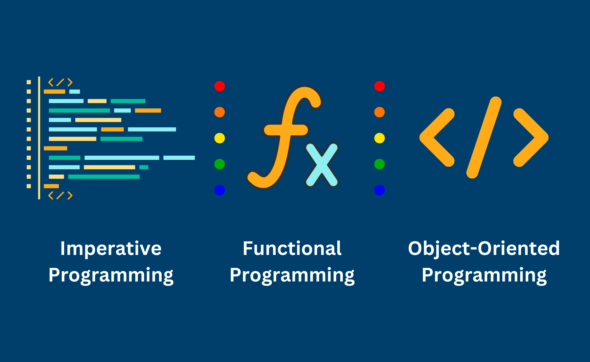

Всё о парадигмах программирования: особенности, механизмы, какие языки поддерживают и т.д.
<!--more-->
### Императивное программирование

Вычислительная техника создавалась для решения математических задач – расчета баллистических траекторий, численного решения уравнений и т.д. Для этого же предназначены первые языки программирования, такие как Fortran, Алгол, реализованные в парадигме императивного программирования.  

Характеристики:
* в исходном коде программы записаны инструкции (команды);
* инструкции должны выполняться последовательно;
* данные, полученные при выполнении инструкции, могут записываться в память;
* данные, получаемые при выполнении предыдущих инструкций, могут читаться из памяти последующими инструкциями.

Основные механизмы управления:
* последовательное исполнение команд;
* использование именованных переменных;
* использование оператора присваивания;
* использование ветвления (оператор `if`);
* использование безусловного перехода (оператор `goto`).

Ключевой идеей императивного программирования является работа с переменными, как с временным хранением данных в оперативной памяти.

---
### Структурное программирование

Струк­тур­ная парадигма программирования на­це­ле­на на со­кра­ще­ние вре­ме­ни раз­ра­бот­ки и уп­ро­ще­ние поддержки про­грамм за счёт ис­поль­зо­ва­ния блочных опе­ра­то­ров и под­про­грамм. От­ли­чительная чер­та струк­тур­ных про­грамм – от­каз от опе­ра­то­ра безусловного пе­ре­хо­да (`goto`), который широко использовался в 1970-х годах.

Основные механизмы управления:
* последовательное исполнение команд;
* использование именованных переменных;
* использование оператора присваивания;
* использование ветвления (оператор if);
* **использование циклов;**
* **использование подпрограмм (функций).**


Парадигму структурного программирования предложил нидерландский ученый Эдсгер Дейкстра.


---
### Объектно-ориентированное программирование

В объектно-ориентированной парадигме программа раз­би­ва­ет­ся на объ­ек­ты – структуры дан­ных, со­стоя­щие из по­лей, опи­сы­ваю­щих со­стоя­ние, и ме­то­дов – функций, при­ме­няе­мых к объ­ек­там для изменения или за­про­са их со­стоя­ния.

Объ­ект­но-ори­ен­ти­ро­ван­ную парадигму программирования под­дер­жи­ваю­т:
* Python;
* C#;
* Java;
* C++;
* JavaScript;
* и другие.

Основные механизмы управления:
* абстракция;
* класс;
* объект;
* полиморфизм;
* инкапсуляция;
* наследование.

---
### Декларативное программирование

Декларативное программирование – парадигма программирования, в которой задаётся спецификация решения задачи, то есть описывается ожидаемый результат, а не способ его получения. Противоположностью декларативного является императивное программирование, при котором на том или ином уровне детализации требуется описание последовательности шагов для решения задачи. В качестве примеров декларативных языков обычно приводят HTML и SQL. При создании HTML с помощью тегов описывается, какую нужно получить страничку в браузере, а не то, как нарисовать на экране заголовок статьи, оглавление и текст.  

К подвидам декларативного программирования также зачастую относят функциональное и логическое программирование. Несмотря на то, что программы на таких языках нередко содержат алгоритмические составляющие, архитектура в императивном понимании (как нечто отдельное от кодирования) в них также отсутствует: схема программы является непосредственно частью исполняемого кода.

---
### Логическое программирование

При использовании логического программирования программа содержит описание проблемы в терминах фактов и логических формул, а решение проблемы система находит с помощью механизмов логического вывода.

В конце 60-х годов XX века Корделл Грин предложил использовать резолюцию как основу логического программирования. Алан Колмеро создал язык логического программирования Prolog в 1971 году. Логическое программирование пережило пик популярности в середине 80-х годов XX века, когда было положено в основу проекта разработки программного и аппаратного обеспечения вычислительных систем пятого поколения.

Важное его преимущество – достаточно высокий уровень машинной независимости, а также возможность откатов, возвращения к предыдущей подцели при отрицательном результате анализа одного из вариантов в процессе поиска решения.

Один из концептуальных недостатков логического подхода – специфичность класса решаемых задач.

Недостаток практического характера – сложность эффективной реализации для принятия решений в реальном времени, скажем, для систем жизнеобеспечения.

---
### Функциональное программирование

Основной инструмент функционального программирования (ФП) – математические функции.

Математические функции выражают связь между исходными данными и итогом процесса. Процесс вычисления также имеет вход и выход, поэтому функция – вполне подходящее и адекватное средство описания вычислений. Именно этот простой принцип положен в основу функциональной парадигмы программирования. 


Функциональное программирование – декларативная парадигма программирования.


Функциональная программа – набор определений функций. Функции определяются через другие функции или рекурсивно через самих себя. При выполнении программы функции получают аргументы, вычисляют и возвращают результат, при необходимости вычисляя значения других функций.

Основные идеи функционального программирования:
- неизменяемые переменные – в функциональном программировании можно определить переменную, но изменить ее значение нельзя;
- чистая функция – это функция, результат работы которой предсказуем. При вызове с одними и теми же аргументами, такая функция всегда вернет одно и то же значение. Про такие функции говорят, что они не вызывают побочных эффектов;
- функции высшего порядка – могут принимать другие функции в качестве аргумента или возвращать их;
- рекурсия – поддерживается многими языками программирования, а для функционального программирования обязательна. Дело в том, что в языках ФП отсутствуют циклы, поэтому для повторения операций служит рекурсия. Использование рекурсии в языках ФП оптимизировано, и происходит быстрее, чем в языках императивного программирования;
- лямбда-выражения – способ определения анонимных функциональных объектов.

Сильные стороны функционального программирования:
* повышенная надёжность кода;
* удобство организации модульного тестирования;
* возможности оптимизации при компиляции;
* возможности параллелизма.

Недостатки: отсутствие присваиваний и замена их на порождение новых данных приводят к необходимости постоянного выделения и автоматического освобождения памяти, поэтому в системе исполнения функциональной программы обязательным компонентом становится высокоэффективный сборщик мусора.