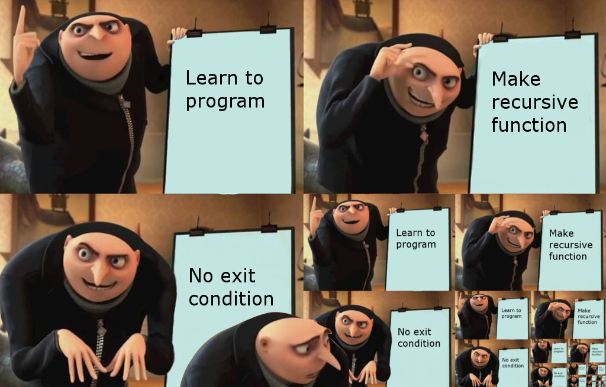

Конспект посвящён рекурсивным функциям в Python
<!--more-->

## Теория
**Рекурсивная функция** — функция, вызывающая саму себя.

Следующая функция является рекурсивной:
```py
def message(times=3):
    if times > 0:
        print('Hi', end=' ')
        message(times - 1)

message()
```
```
# Вывод:
Hi Hi Hi
```


Если в рекурсии не предусмотрено условие выхода, то вызовы функции переполнят стек, в следствии чего возникнет исключение `RecursionError`


Во время каждого вызова функции `message()` в оперативной памяти создается новый экземпляр переменной `times`. При первом вызове функции `times` имеет значение 3. Когда функция себя вызывает, создается новый экземпляр переменной `times` и в него передается значение 2. Этот цикл повторяется до тех пор, пока в функцию в качестве аргумента не будет передан 0.

Количество раз, которые функция вызывает саму себя, называется **глубиной рекурсии**. Глубина функции `message()` равняется 3.


Любая задача, которая может быть решена с помощью рекурсии, может быть решена и без неё (циклами). Иногда целесообразнее использовать циклы, поскольку процесс вызова функций более ресурсозатратен по сравнению с итерацией


В общем случае рекурсивная функция устроена следующим образом:
* Если в настоящий момент задача может быть решена без рекурсии, то функция ее решает (**условие выхода**).
* Если в настоящий момент задача не может быть решена, то функция ее сводит к уменьшенной и при этом аналогичной задаче и вызывает саму себя для решения этой уменьшенной задачи (**рекурсивный случай**).

**Хвостовая рекурсия** — частный случай рекурсии, при котором любой рекурсивный вызов является последней операцией перед возвратом из функции.

Вот, к примеру, хвостовая рекурсивная функция:
```py
def message(times):
    if times > 0:
        print('Recursion')
        message(times - 1)
```

А вот не хвостовая:
```py
def message(times):
    if times > 0:
        print('Recursion')
        message(times - 1)
        print(times)
```

Рекурсия также может быть сделана с помощью `lambda`-функций:
```py
fact = lambda n: 1 if n == 0 else n * fact(n - 1)

print(*map(fact, range(1, 11)))

# Вывод: 1 2 6 24 120 720 5040 40320 362880 3628800
```

---
## Примеры рекурсий

### Задача 1
Пусть требуется реализовать функцию `draw_rect()` с использованием рекурсии, которая печатает звёздный прямоугольник размерами `width * height`. Чтобы явно не передавать шаг в вызов функции, можно воспользоваться вложенной функцией и механизмом замыкания


Замыкание — функция, определённая внутри другой функции и использующая переменные из локальной области видимости внешней функции


```py
def draw_rect(width, height):
    def rec(step):
        if step < height:
            print('*' * width)
            rec(step + 1)
    rec(0)
```

Функция `draw_rect()` определяет внутри себя рекурсивную функцию `rec()`, которая имеет один параметр `step` и имеет доступ к переменным `width` и `height` внешней функции. Затем функция `draw_rect()` вызывает внутреннюю рекурсивную функцию, передавая в качестве `step` значение 0.

### Задача 2
Пусть требуется реализовать функцию `factorial()` с использованием рекурсии, которая возвращает факториал неотрицательного числа `n`:
```py
def factorial(n):
    if n == 0:
        return 1                   # Условие выхода
    else:
        return n * factorial(n-1)  # Рекурсивный случай
```

### Задача 3
Дан список, элементами которого могут быть только строки или аналогичные списки, содержащие строки и вложенные списки. С помощью рекурсивной функции `get_all_str()` необходимо вывести все строки из данного списка и из всех вложенных, разделив пробелом:
```py
def get_all_str(data):
    if type(data) == str:
        print(data, end=' ')  # Условие выхода
    if type(data) == list:
        for i in data:
            get_all_str(i)    # Рекурсивный случай
```
```
# Ввод: get_all_str(['1', ['2', '3', ['4'], ['5', ['6', '7']]]])
# Вывод: 1 2 3 4 5 6 7 
```

### Задача 4
Дан словарь произвольной вложенности, то есть значениями в словаре могут быть другие словари. С помощью рекурсивной функции `find_key()` необходимо определить значение, которое соответствует заданному ключу, и вернуть его. При этом гарантируется, что такой ключ имеется в словаре, причем он единственный:
```py
def find_key(data, key):
    if key in data:
        return data[key]              # Условие выхода
    
    for v in data.values():
        if type(v) == dict:
            value = find_key(v, key)  # Рекурсивный случай
            if value is not None:
                return value 
```

### Задача 5
Пусть требуется реализовать функцию `fib()` с использованием рекурсии, которая находит `n`-ное число Фибоначчи:
```py
def fib(n):
    if n <= 2:
        return 1                        # Условие выхода
    else:
        return fib(n - 1) + fib(n - 2)  # Рекурсивный случай
```

При такой реализации происходит многократное вычисление одних и тех же значений. 

---
## Мемоизация

**Мемоизация** — метод оптимизации, при котором результат выполнения функции кэшируется (сохраняется) и используется в следующем вызове.

Перепишем функцию из задачи 3 с использованием мемоизации:
```py
def fib(n):
    ​cache = {1: 1, 2: 1}  # Ключ — номер числа, значение — число Фибоначчи
    def fib_rec(n):
        result = cache.get(n)
        if result is None:
            result = fib_rec(n - 2) + fib_rec(n - 1)
            cache[n] = result
        return result
    return fib_rec(n)
```

---
## Настройка глубины рекурсии

По умолчанию Python имеет ограничение на максимальную глубину рекурсивных вызовов, которое не позволяет бесконечной рекурсии вызывать переполнение стека.

Получить значение по умолчанию (1000) для максимальной глубины рекурсии можно с помощью функции `getrecursionlimit()` из модуля `sys`.

Чтобы явно указать значений максимальной глубины рекурсии, нужно воспользоваться функцией `setrecursionlimit()` из того же `sys`.

```py
import sys

limit = sys.getrecursionlimit()
print(limit)

sys.setrecursionlimit(6000)
new_limit = sys.getrecursionlimit()
print(new_limit)
```
```
# Вывод:
1000
6000
```

---

**Основной источник:** https://stepik.org/course/82541