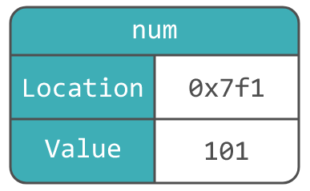
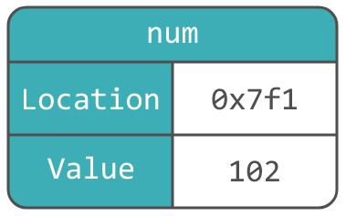
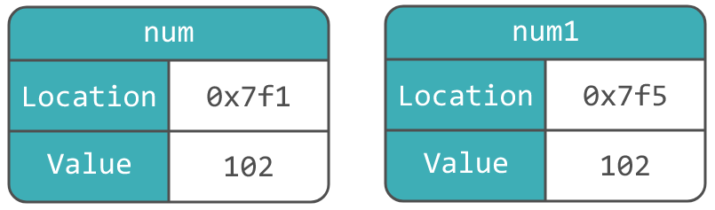
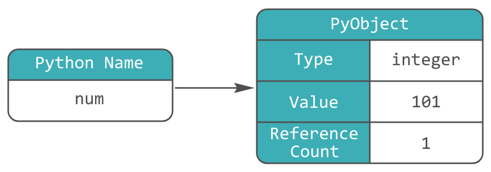
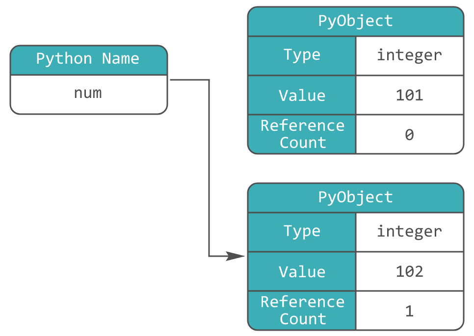
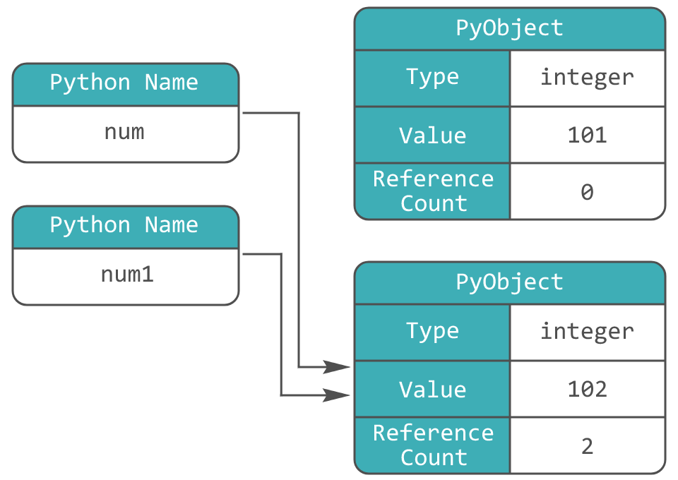
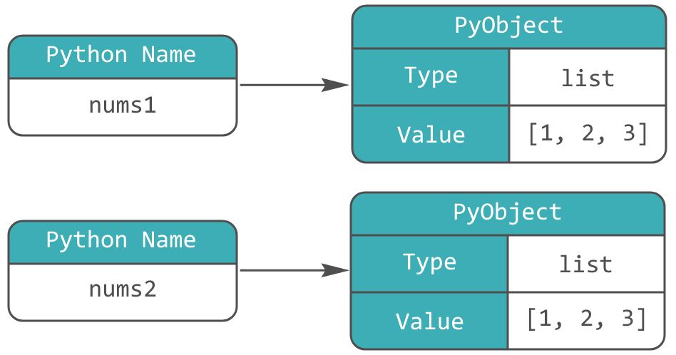
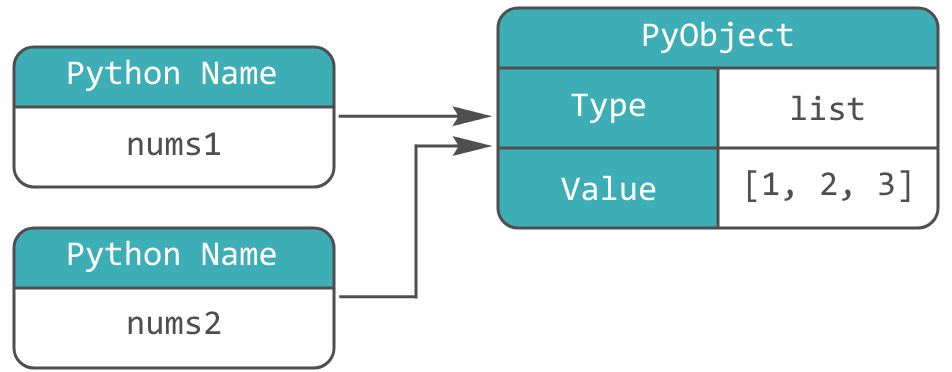

Конспект посвящён переменным в Python: как они устроены, чем отличаются от переменных в других ЯП и т.д., а также интернированию, неизменяемым и изменяемым типам данных, поверхностному и глубокому копированию.
<!--more-->

Начнём с того, что в Python **нет переменных**. По-крайней мере в том виде, в котором они представлены в более низкоуровневых ЯП, таких как C или C++. Вместо этого в Python — имена. Разберёмся, в чём здесь разница.

## Переменные в C и C++

```cpp
int num = 101;
```

Исполнение вышележащей строки проходит через три этапа:
1. Выделение достаточного количества памяти для числа;
2. Присвоение этому месту в памяти значения 101;
3. Отображение, что `num` указывает на это значение.

Упрощённо это можно представить следующим образом:



Здесь переменная `num` имеет виртуальный адрес `0x7f1` и значение 101. Если позднее нам захочется изменить значение, это можно сделать так: `int num = 102;`.

Этот код присваивает переменной `num` новое значение 102, тем самым перезаписывая предыдущее значение. Это означает, что переменная изменяема. Обновлённая схема памяти для нового значения:



Расположение переменной в памяти не поменялось, но поменялось значение, а значит `num` — место в памяти, а не просто имя.

Если мы выполним следующий код: `int num1 = num;`, мы получим уже две абсолютно разные области памяти, с различными адресами (хоть и одинаковым значением).



С переменными в Python ситуация другая.

---
## Переменные в Python

В Python нет переменных, как таковых, вместо них **имена**. Вполне допустимо использовать термин переменные, однако важно понимать разницу.

Напишем тот же код на Python: `num = 101`.

Исполнение также происходит в несколько этапов:
1. Создаётся специальный объект `PyObject`;
2. Заполняется его поле `Type`, которое указывает на тип;
3. Заполняется его поле `Value`, которое указывает на значение;
4. Создаётся имя `num`;
5. Имя `num` начинает указывать на созданный `PyObject`;
6. Счётчик ссылок (поле `Reference Count`) объекта `PyObject` увеличивается на 1.

Можно представить себе это следующим образом:



Как видно, схемы памяти для Python и C/C++ отличаются. Вместо того, чтобы `num` владел блоком памяти, в котором хранится значение 101, `num` ссылается на участок памяти, которой владеет `PyObject` объект.

Присвоим переменной новое значение: `num = 102`. Исполнение этой строки кода также проходит через несколько этапов:
1. Создаётся новый `PyObject`;
2. Заполняется его поле `Type`, которое указывает на тип;
3. Заполняется его поле `Value`, которое указывает на значение;
4. Имя `num` указывает на новый `PyObject`;
5. Счётчик ссылок (поле `Reference Count`) нового `PyObject` увеличивается на 1;
6. Счётчик ссылок (поле `Reference Count`) старого `PyObject` уменьшается на 1.

Взглянем на новую схему памяти:



Изображение демонстрирует, что переменная привязалась к новому объекту и отвязалась от предыдущего. К тому же `PyObject`, содержащий значение 101, теперь имеет счётчик ссылок, равным 0, а значит будет уничтожен сборщиком мусора (GC).

Введём новую переменную (имя): `num1 = num`. В памяти не появится нового объекта, новое имя будет ссылаться на уже существующий (счётчик ссылок которого будет увеличен на 1):



Важно также отметить, что структуры данных, ровно как имена, содержат указатели на объекты. Допустим, у нас есть список `nums = [1, 2, 3]`. В нём не хранятся сами значение, а хранятся указатели на них, а сами объекты `1`, `2` и `3` содержатся в других областях памяти.

### Адрес объекта
У каждого объекта в Python есть собственный идентификатор, который устанавливается только один раз при его создании. Идентификатор объекта – это целое и постоянное число, которое никогда не изменяется после его создания. В стандартной реализации Python (CPython) идентификатор объекта ассоциируется с адресом объекта в памяти. Для того чтобы получить идентификатор объекта, используется встроенная функция `id()`.
```py
name = 'Ivan'
age = 29
is_teacher = True

print(id(name))
print(id(age))
print(id(is_teacher))
```

```
# Возможный вывод:
2226167895200
140710064049464
140710063254608
```

При каждом новом запуске id будут разные, так как заранее не устанавливается, какое значение будет в определённым участком памяти. Таким образом, объекты, периоды существования которых не пересекаются, могут иметь одинаковый id.

Если объекты изменяемые, то в большинстве случаев они будут иметь разные идентификаторы. Например:
```py
nums1 = [1, 2, 3]
nums2 = [1, 2, 3]

print(nums1 == nums2)
print(id(nums1))
print(id(nums2))
```

```
# Вывод:
True
2303843075456
2303886617792
```


Оператор сравнения `==` сравнивает объекты поэлементно, а не по id


Получаем, что переменные `nums1` и `nums2` указывают на разные адреса памяти, хоть и имеют одинаковое содержимое.



Нужно также помнить, что оператор присваивания `=`, никогда не создает копию данных, а, скорее, привязывает имя к объекту. Следующий код будет выводить одинаковые id:

```py
nums1 = [1, 2, 3]
nums2 = nums1

print(id(nums1))
print(id(nums2))
```

```
# Вывод:
2002273207680
2002273207680
```




Некоторые объекты существуют в единичном экземпляре, например `None`, `True`, `False` и другие


#### Оператор `is`
С помощью оператора `is` можно сравнить id объектов:
```py
nums1 = [1, 2, 3]
nums2 = [1, 2, 3]
nums3 = nums1

print(nums1 is nums2, nums1 == nums2)
print(nums1 is nums3, nums1 == nums3)
print(nums2 is nums3, nums2 == nums3)
```

```
# Вывод:
False True
True True
False True
```

Для проверки значения на равенство с `None` обычно используют `is`:
```py
value = None

if value is None:
    print('Пусто')
```

---
### Интернирование объектов
Как мы знаем, в Python целые числа (тип `int`) и строки (тип `str`) являются неизменяемыми. Это значит, что после того как строковые и целочисленные объекты были созданы, мы не можем изменить или обновить их. Даже если кажется, что строка изменяется, например, после использования метода, на самом деле создается новая строка, а исходная остается прежней.

Учитывая неизменяемость строковых и целочисленных объектов, Python использует специальную оптимизацию, которая называется интернированием. Интернирование — это процесс хранения в памяти только одной копии объекта. Это означает, что, когда мы создаем две строки (два целых числа) с одинаковыми значениями, то вместо выделения памяти для них обоих, только одна строка (целое число) фактически фиксируется в памяти. Другая же просто указывает на то же самое место в памяти. Для реализации данной оптимизации Python использует специальную таблицу, которая называется пул интернирования. Эта таблица содержит одну уникальную ссылку на каждый объект строкового типа, либо целого числа.

Основные преимущества интернирования:
* Экономия памяти: мы не храним копии одинаковых объектов;
* Быстрые сравнения: сравнение интернированных строк происходит намного быстрее, чем неинтернированных строк. Это происходит потому, что для сравнения интернированных строк нужно только сравнить, совпадают ли их адреса в памяти, а не сравнивать их содержимое.

#### Интернирование целых чисел
Python интернирует целые числа в диапазоне [-5; 256]. Если мы наберём следующий код в IDLE:
```py
num1 = 100
num2 = 100

num3 = 1000
num4 = 1000

print(num1 is num2, num1 == num2)
print(num3 is num4, num3 == num4)
```
получим такой результат:
```
True True
False True
```

Но среда, в которой пишется код, может самостоятельно указывать диапазон интернирования. Так, в VS Code, тот же самый код вернёт:
```
True True
True True
```

#### Интернирование строк
В **Python 3.7** интернируются строки, содержащие не более **20 символов** и состоящие только из ASCII-букв, цифр и знаков подчёркивания. Данный набор символов был выбран потому, что он часто используется в нашем коде. 
```py
s1 = 'beegeek'
s2 = 'beegeek'
s3 = 'bee' + 'geek'

print(id(s1))
print(id(s2))
print(id(s3))
```

```
# Вывод:
2846528331184
2846528331184
2846528331184
```

Добавим символ `!` в строку:
```py
s1 = 'beegeek!'
s2 = 'beegeek!'

print(id(s1))
print(id(s2))
```

```
# Вывод:
2846528331312
2846528331440
```

Начиная **с Python 3.8** длина интернируемых строк была увеличена до **4096 символов**.

```py
s1 = 'b' * 4096
s2 = 'b' * 4096

s3 = 'b' * 5000
s4 = 'b' * 5000

print(s1 is s2)
print(s3 is s4)
```

```
# Вывод:
True
False
```

Как я понял, VS Code применяет свои правила интернирования и для строк, а конкретно интернирует любую последовательность символов длинной до 4096 включительно.

#### Функция `sys.intern()`
Как мы уже знаем, Python интернирует лишь строки, содержащие не более 4096 символов и состоящие только из ASCII-букв, цифр и знаков подчёркивания. Однако функция `intern()` из модуля `sys` позволяет интернировать любую строку, например, содержащую 5000 символов или состоящую из букв русского алфавита. Данная функция принимает в качестве аргумента строку, добавляет ее в пул интернирования (если ее там нет) и возвращает интернированную строку.
```py
import sys

s1 = sys.intern('степик!')
s2 = sys.intern('степик!')

print(s1 is s2)

# Вывод: True
```

---
## Изменяемые и неизменяемые типы данных

Типы данных в Python делятся на две категории:
* изменяемые (mutable) — `list, set, dict, ...`;
* неизменяемые (immutable) — `int, float, bool, tuple, str, ...`.

Если мы попытаемся изменить, например, строку, то получим ошибку:
```py
data = 'beegeek'
data[0] = 'B'

print(data)

# Вывод: TypeError: 'str' object does not support item assignment
```

В то же время мы запросто можем изменить список:
```py
data = ['b', 'e', 'e', 'g', 'e', 'e', 'k']
data[0] = 'B'

print(data)

# Вывод: ['B', 'e', 'e', 'g', 'e', 'e', 'k']
```

### Присваивание vs "мутация"
В Python есть два вида изменения объектов:
* Присваивание переменной нового объекта
* Мутация (непосредственное изменение) самого объекта

Слово "изменение" зачастую носит двусмысленный характер. Фраза "мы изменили x" может означать "мы переназначили x", а может означать "мы мутировали объект, на который указывает x".

Например, следующий код повторно связывает имя с совершенно новым объектом: `x = x + 1` (адрес `num` изменился). Но такая операция как `num.append(7)` добавляет элемент в уже существующий объект, то есть `num` указывает всё на тот же объект (адрес `num` не изменился).


Работа `+=` в Python реализована через значение `x`. Эти две строки эквивалентны: `x += y` и `x = x.__iadd__(y)`


Таким образом, если несколько имён ссылаются на один изменяемый объект, и программист модифицирует этот объект, изменения отразятся в каждом из имён:
```py
nums1 = [1, 2, 3]
nums2 = nums1

nums1.append(4)

print(nums1)
print(nums2)
```

```
[1, 2, 3, 4]
[1, 2, 3, 4]
```

Важно понимать, что со списками операции `x = x + y` и `x += y` работают по-разному. В первом случае, как мы уже знаем, создаётся новый объект, но при `+=` модифицируется существующий список:
```py
nums1 = [1, 2, 3]
nums2 = nums1
nums3 = [1, 2, 3]
nums4 = nums3

nums1 = nums1 + [4, 5]

print(nums1)
print(nums2)
print()
print(nums3)
print(nums4)
```

```
# Вывод:
[1, 2, 3, 4, 5]
[1, 2, 3]

[1, 2, 3, 4, 5]
[1, 2, 3, 4, 5]
```

Причина такого поведения в том, что список реализует `__iadd__` следующим образом:
```py
class List:
    def __iadd__(self, other):
        self.extend(other)
        return self
```

То есть такой код: `nums1 += nums2`, эквивалентен: `nums1.extend(nums2)`.

---
## Модуль `copy`

Для использования: `import copy`.

Как мы уже знаем, оператор присваивания в Python не создает копию объекта, он лишь связывает имя переменной с объектом. Для создания реальных копий объектов в Python используют модуль `copy`.

Модуль `copy` содержит две функции:
`copy()`: копирует объект и возвращает его поверхностную копию;
`deepcopy()`: копирует объект и возвращает его глубокую копию.

Разницу между этими видами копирования можно проследить только для коллекций.

### Поверхностное копирование
Поверхностное копирование создает отдельный новый объект, но вместо копирования дочерних элементов в новый объект, оно просто копирует ссылки на их адреса памяти.
```py
import copy

data1 = [1, 2, 3]
data2 = copy.copy(data1)
data1.append(4)

print(id(data1), data1)
print(id(data2), data2)
```

```
# Вывод:
2072210867584 [1, 2, 3, 4]
2072250543808 [1, 2, 3]
```

Как видно, id объектов, как и их содержимое, различаются, так как элементами списка являются целые числа, поэтому изменение одного списка не отражается на другом. Если бы элементами списка были бы изменяемые типы, то поверхностное копирование скопировало бы лишь ссылки на их адреса памяти. Следовательно, любое изменение элементов одного объекта отразилось бы также и на элементах другого объекта.

В следующем коде видно, что изменения затронули оба списка, потому что оба они содержат ссылки на один и тот же вложенный объект. Так работает поверхностное копирование:

```py
import copy

data1 = [[1, 2, 3], [4, 5, 6]]
data2 = copy.copy(data1)

data1[0].append(7)
data2[1].append(8)

print(id(data1), data1)
print(id(data2), data2)
```

```
# Вывод:
2088862020160 [[1, 2, 3, 7], [4, 5, 6, 8]]
2088872808384 [[1, 2, 3, 7], [4, 5, 6, 8]]
```

У списков, словарей и множеств есть собственный метод `copy()`, создающий их поверхностную копию:
```py
data1 = [1, 2, 3, 4]
data2 = [[1, 2], [3, 4]]

new_data1 = data1.copy()
new_data2 = data2.copy()
```

Поверхностную копию также можно создать, используя соответствующие функции для каждой коллекции (`list, dict, set, ...`):
```py
data1 = [1, 2, 3, 4]
data2 = {'a': 1, 'b': 2}
data3 = {1, 2, 3, 4}

new_data1 = list(data1)
new_data2 = dict(data2)
new_data3 = set(data3)
```

Ещё поверхностную копию списка можно сделать через срез: `new_data = data[:]`

### Глубокое копирование
Глубокое копирование создаёт копию составного объекта рекурсивно. Это означает, что любые изменения, внесенные вами в новую копию объекта, не будут отражаться в исходной, и наоборот.
```py
import copy

data1 = [[1, 2, 3], [4, 5, 6]]
data2 = copy.deepcopy(data1)

data1[0].append(7)
data2[1].append(8)

print(id(data1), data1)
print(id(data2), data2)
```

```
# Вывод:
2001097388608 [[1, 2, 3, 7], [4, 5, 6]]
2001108045760 [[1, 2, 3], [4, 5, 6, 8]]
```


При глубоком копировании временные затраты на создание копии, очевидно выше чем при создании поверхностной копии. Если копируемый объект имеет сложную вложенную структуру, то глубокое копирование может занять кучу времени.


---

Основной источник: https://stepik.org/lesson/624529/step/1?unit=620219

Дополнительные источники: 
* [Habr](https://habr.com/ru/companies/otus/articles/666858/)
* [Ned Batchelder](https://www.youtube.com/watch?v=_AEJHKGk9ns)