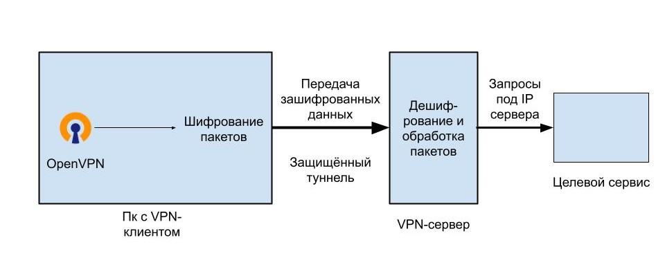

# Анонимность в сети

Дисклеймер: Материл носит исключительно информационный характер. Автор не призывает к каким-либо действиям.

В этой статье разберём:
* Как делать анонимные запросы
* Как общаться безлично
* Как поставить безопасную ОС на свой пк
* Как оплачивать товары/услуги, не оставляя о себе информации
* Человеческие ошибки, деанонимизирующие пользователя
&lt;!--more--&gt;

## Способы анонимизации

Пожалуй, стоит начать с факта, который каждый наверняка не раз слышали: абсолютной анонимности в современном мире не существует. Тем не менее, при должном упорстве можно обеспечить себе достойный уровень скрытности, при котором вы сможете договориться со своей паранойей)

Для начала поговорим о простых способах скрыть свой IP при посещении сайтов, а также как просматривать запрещённые ресурсы в РФ. Уверен, большинство посетителей и-так знают о Proxy/VPN/Tor, поэтому вам предлагаю перейти сразу к этому разделу. Совсем юным анонимусам лучше начать читать пряяямо отсюда 👇

### Proxy
Наиболее простая технология, позволяющая скрывать настоящий IP, MAC адреса и прочее. Работает как отдельный пк (сервер), расположенный как минимум вне страны пользователя и отправляющий запросы на посещаемый источник вместо вас. То есть вместо того, чтобы напрямую соединить хост с целевым сервисом, прокси-сервер пропускает трафик через себя и устанавливает соединения от своего имени, скрывая информацию юзера.

Важными недостатками технологии являются отсутствие шифрования трафика при использовании бесплатных посредников и весьма вероятное ведение логов, то есть записей посещаемых сайтов, отпечатка браузера, деталей ОС и прочей информации. Ну а совсем недобросовестные провайдеры могут пытаться перехватить данные, которые пользователь вводит на посещаемых ресурсах.

Лично я использую этот вариант только для посещения локально заблокированных ресурсов, но не для подмены личности. И вам советую не ограничиваться лишь одним прокси, если нужно скрыть данные от посторонних глаз.

### VPN
Virtual Private Network — более интересная технология по сравнению с предыдущей. В ней также используются удалённые сервера, но, в отличие от большинства прокси, пакеты дынных (то есть вся информация) проходят этап шифрования. Происходит это так: VPN-клиент на устройстве пользователя шифрует отправляемые запросы, которые затем отправляются по заранее созданному туннелю на удалённый сервер. Там данные расшифровываются, и запрос идёт уже с ip сервера прямиком к нужному сайту, затем ответ от этого сайта возвращается к vpn-серверу, где шифруется и передаётся пользователю по тому же туннелю, а VPN-клиент дешифрует данные. В итоге данные нельзя &#34;прослушать&#34;, а если и получится, то придётся их расшифровать. Ну и конечно же, конечный сервис будет не в курсе, что на самом деле запрос отправлялся нами.

На следующем рисунке представлена поверхностная схема отправки запроса через протокол [OpenVPN](https://openvpn.net/)

---

> Автор: [NoisyCake](https://t.me/noisy_cake)  
> URL: http://localhost:1313/articles/anonimity/  

