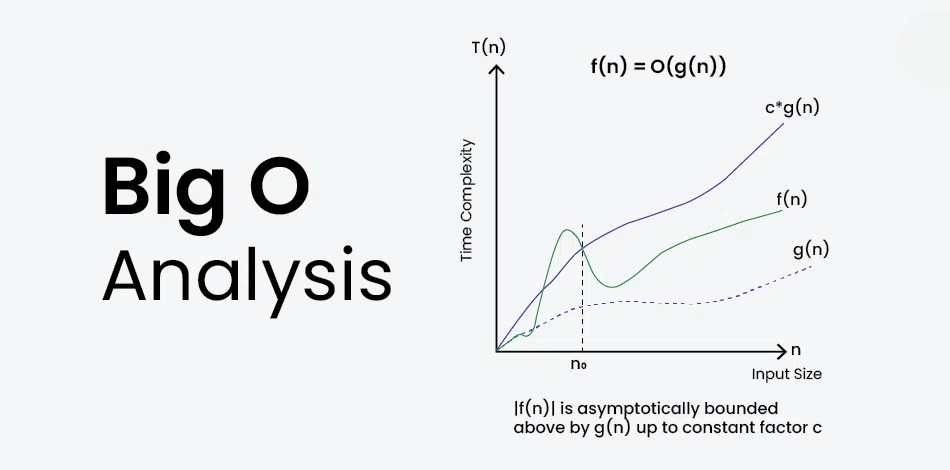

# Big O


Всё про нотацию Big O на примерах базовых коллекций в Python



&lt;!--more--&gt;
Big O — нотация, использующаяся в программировании, информатике для описания сложности алгоритмов. Она характеризует скорость роста времени выполнения алгоритма с ростом объёма входных данных, используя для оценки верхнюю границу (наихудший исход).

Примеры нотаций Big O в порядке убывания скорости выполнения соответствующих им алгоритмов:
* `O(1)`: Константная сложность. Читается как &#34;сложность порядка 1&#34;. Время выполнения алгоритма не зависит от размера входных данных, то есть если даже алгоритм выполняется постоянно в 3 шага, то он будет не O(3), а **O(1)**. Является идеальной с точки зрения производительности, однако зачастую недостижима.  
Примеры:
    - Доступ к элементу в массиве по индексу;
    - Вставка или удаление элемента в конец списка (очереди) фиксированной длины.

* `O(log n)`: Логарифмическая сложность. Время выполнения алгоритма растет медленно с увеличением размера входных данных. Например, бинарный поиск в отсортированном массиве.  
Пример:
    - Бинарный поиск. В этом алгоритме на каждом шаге половина данных отсекается, и поиск продолжается в оставшейся половине. Это означает, что при увеличении размера входных данных вдвое, бинарный поиск требует всего одного дополнительного шага.

* `O(n)`: Линейная сложность. Читается как &#34;сложность порядка n&#34;. Время выполнения алгоритма пропорционально размеру входных данных.  
Пример:
    - Поиск максимального значения в списке:
    ```py
    def find_max(my_list):
        max_num = my_list[0]
        for i in range(len(my_list)):
            if my_list[i] &gt; max_num:
                max_num = my_list[i]
        return max_num
    ```

* `O(n log n)`: Линейно-логарифмическая сложность. Время выполнения алгоритма растет быстрее, чем линейно, но медленнее, чем квадратично.  
Пример:
    - Сортировка слиянием.

* `O(n^2)`: Квадратичная сложность.  
Примеры:
    - Сортировка пузырём;
    - Поиск суммы всех пар элементов списка:
    ```py
    def pairs_sum(my_list):
        summ = 0
        for i in range(my_list):
            for j in range(my_list):
                summ &#43;= my_list[i] &#43; my_list[j]
        return summ
    ```

* `O(n^3)`: Кубическая сложность.   
Пример:
    - Алгоритмы, имеющие три вложенных цикла.

* `O(2^n)`: Экспоненциальная сложность. Она обычно не является оптимальным решением из-за своей высокой вычислительной нагрузки при увеличении размера входных данных.  
Пример:
    - Алгоритмы, использующие рекурсию без оптимизации (рекурсивное вычисление чисел Фибоначчи).

* `O(n!)`: Факториальная сложность. Это самая высокая степень роста времени выполнения алгоритма. Этот тип сложности встречается, например, при переборе всех возможных комбинаций элементов, что делает его чрезвычайно неэффективным для больших значений n.  
Пример:
    - Перебор всех перестановок элементов массива.

### &lt;center&gt;График сложностей алгоритмов&lt;/center&gt;


---
### Несущественное не учитывается
При оценке сложности алгоритмов лучше игнорировать константы и несущественные части, от которых скорость выполнения практически не зависит.  

Например, при оценке 5n^2 &#43; 3n &#43; 2 можно откинуть 5, 3n, 2. В результате мы получим `O(n^2)`.  
Или при оценке n^2 &#43; n &#43; log(n) оставляем самую значимую часть (перемененную с наибольшей степенью) и получаем тот же`O(n^2)`.  

---
## &lt;center&gt;Сложность операций в Python&lt;/center&gt;

Рассмотрим некоторые операции, которые часто используют для базовых структур в языке программирования Python.
n — размер структуры данных
### Списки:
|Операция|Пример|Сложность|Примечание|
|:--|:--|:--|:--|
|Получение элемента|`l[i]`|O(1)|
|Присваивание значения элементу|`l[i] = 0`|O(1)|
|Размер списка|`len(l)`|O(1)|
|Добавление элемента в конец списка|`l.append(5)`|O(1)|**Скорее всего это неверно**|
|Удаление последнего элемента|`l.pop()`|O(1)|Аналогично `l.pop(-1)`|
|Очищение списка|`l.clear()`|O(1)|Аналогично `l = []`|
|Добавление нескольких элементов|`l1.extend(l2)`|O(len(n))|Прямая зависимость с размером l2|
|Создание списка|`list(l)`|O(n)|Прямая зависимость с разером l|
|Получение среза|`l[a:b]`|O(n)|O(a - b)|
|Сравнение списков|`l1 == l2`|O(n)|
|Вставка через срез|`l[a:b]`|O(n)|
|Проверка наличия элемента в списке|`x is/not in l`|O(n)|Тот же перебор элементов|
|Поверхностное копирование списка|`l.copy()`|O(n)|Аналогично `l[:]`|
|Удаление элемента через `del`|`del l[i]`|O(n)|Перебор до совпадения индексов, &lt;br&gt;а значит зависит от `i`|
|Удаление элемента через `remove`|`l.remove(...)`|O(n)|
|Удаление элемента через `pop`|`l.pop(i)`|O(n)|O(n-i)|
|Получение крайнего значения|`min(l)/max(l)`|O(n)|Снова перебор элементов|
|Получение обратного списка|`l.reverse()`|O(n)|
|Перебор|`for i in l:`|O(n)|
|Сортировка|`l.sort()`|O(n * log(n))|Или `sorted(l)`|
|Умножение списка на константу|`k*l`|O(k*n)|`5*l` =&gt; O(n), `len(l)*l` =&gt; O(n^2)|

---
### Кортежи:
Кортежи — те же самые списки, только неизменяемые. Поэтому к ним применимы все операции, не изменяющие структуру данных, и они имеют такие же нотации сложности, как и списки.

---
### Множества:
|Операция|Пример|Сложность|Примечание|
|:--|:--|:--|:--|
|Размер множества|`len(s)`|O(1)|
|Добавление элемента|`s.add(5)`|O(1)|
|Проверка наличия элемента в множестве|`x is/not in s`|O(1)|
|Удаления элемента через `discard`|`s.discard(...)`|O(1)|
|Удаления элемента через `remove`|`s.remove(...)`|O(1)|
|Удаления элемента через `pop`|`s.pop()`|O(1)|Удаляемый элемент выбирается случайно|
|Очищение множества|`s.clear()`|O(1)|Аналогично `s = set()`|
|Создание множества|`set(...)`|O(n)|
|Сравнение множеств через `==`, `!=`|`s != t`|O(n)|
|Сравнение множеств через `&lt;=`, `&lt;`|`s &lt;= t`|O(n)|Аналогично `s.issubset(t)`|
|Сравнение множеств через `&gt;=`, `&gt;`|`s &gt;= t`|O(n)|Аналогично `s.issuperset(t)`|
|Объединение|`s \| t`|O(n)|Аналогично `s.union(t)`|
|Пересечение|`s &amp; t`|O(n)|Аналогично `s.intersection(t)`|
|Разность|`s - t`|O(n)|Аналогично `s.difference(t)`|
|Симметрическая разность|`s ^ t`|O(n)|Аналогично `s.symmetric_difference(t)`|
|Перебор|`for i in s:`|O(n)|
|Копирование|`s.copy()`|O(n)|

---
### Неизменяемые множества
Поддерживают все операции обычного множества за исключением тех, который изменяют структуру данных, и имеют те же нотации сложности, как у изменяемых множеств.

---
### Словари
|Операция|Пример|Сложность|Примечание|
|:--|:--|:--|:--|
|Получение элемента|`d[key]`|O(1)|
|Добавление элемента/&lt;br&gt;Изменение значения|`d[key] = val`|O(1)|
|Размер словаря|`len(d)`|O(1)|
|Удаление элемента через `del`|`del d[key]`|O(1)|
|Удаление элемента через `popitem`|`d.popitem()`|O(1)|Удаляемый элемент выбирается случайно|
|Удаление элемента через `pop`|`d.pop(key)`|O(1)|
|`get()` и `setdefault()`|`d.get(key)`|O(1)|
|Очищение словаря|`d.clear`|O(1)|Аналогично `s = {}` или `s = dict()`|
|Получение списка ключей/значений|`d.keys()`|O(1)|
|Создание словаря|`dict(...)`|O(n)|
|Перебор элементов|`for key in d:`|O(n)|Для `.keys()`, `.values()`, `.items()`|

---
## &lt;center&gt;Другие обозначения&lt;/center&gt;
Кроме обозначения &#34;Big O&#34;, существуют другие обозначения для оценки сложности алгоритмов:
* **Big Theta (Θ)**: Big Theta также оценивает верхнюю и нижнюю границы временной сложности алгоритма, но описывает точную сложность, а не только наихудший случай, как Big O. Θ(f(n)) обозначает, что время выполнения алгоритма ограничено функцией f(n) как сверху, так и снизу.
* **Big Omega (Ω)**: Big Omega оценивает нижнюю границу временной сложности алгоритма. Ω(f(n)) говорит о том, что алгоритм выполнится не быстрее, чем функция f(n).
* **Little O (o)**: Little O представляет собой верхнюю границу, которая строже, чем Big O. Если f(n) является o(g(n)), это означает, что время выполнения алгоритма ограничивается функцией g(n), но алгоритм работает быстрее, чем g(n).
* **Little Omega (ω)**: Little Omega представляет собой нижнюю границу, которая строже, чем Big Omega. Если f(n) является ω(g(n)), это означает, что алгоритм работает медленнее, чем g(n), но не медленнее, чем f(n).

---

> Автор: [NoisyCake](https://t.me/noisy_cake)  
> URL: http://localhost:1313/notes/big_o/  

