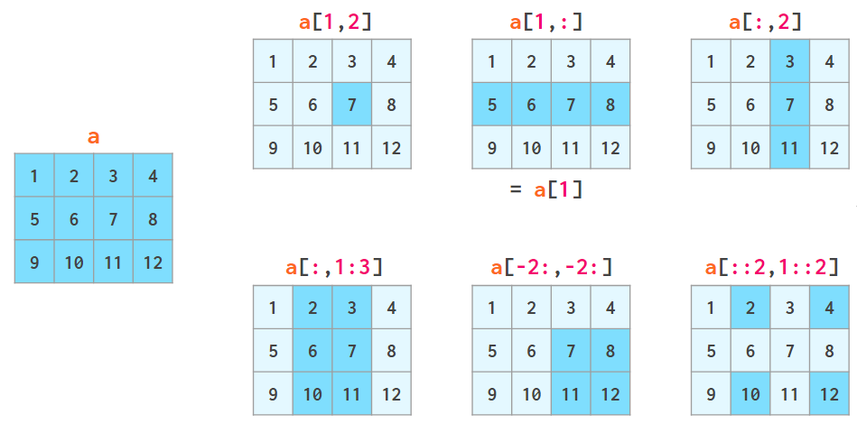

# NumPy


{{&lt; admonition warning &gt;}}
В процессе написания!
{{&lt; /admonition &gt;}}

Конспект посвящён модулю NumPy и основам его применения.
&lt;!--more--&gt;

## Введение

Вечно актуальная документация: https://numpy.org/doc/stable/index.html

numpy — библиотека Python, которая предоставляет мощные и универсальные вычисления с многомерными массивами, математическими функциями и другими инструментами. Чаще всего применяется в анализе и машинном обучении.

Операции с массивами NumPy проходят быстрее и эффективнее обычных Python lists, поскольку все элементы в них имеют одинаковый тип, а сами данные хранятся единым блоком.

Обычно библиотеку импортируют так:
`import numpy as np`

---
## `ndarray`

`ndarray` — основной тип данных в NumPy. Он представляет из себя многомерный однородный массив и обладает следующими характеристиками:
* **Многомерный.** С помощью библиотеки можно создавать вектора, матрицы, трёхмерные массивы и т.д.
* **Однородные типы.** Все элементы `ndarray` принадлежат одному и тому же типу данных.
* **Индексируемый.** К `ndarray` можно обращаться по индексу. Также поддерживаются многомерные срезы.

### Атрибуты
|attribute|purpose|
|:--:|:--|
|`shape`|Содержит форму массива в виде кортежа, где каждое число указывает на количество элементов в соответствующем измерении. Например, для объекта `array([[1, 2, 3, 4], [1, 2, 3, 4]])` shape будет `(2, 4)`|
|`dtype`|Тип данных элементов массива|
|`size`|Общее количество элементов в массиве|
|`ndim`|Количество измерений массива|

---
## Создание массива
ndarray создаётся различными функциями, например `array()`, `arange()`, `zeros()`, `ones()` и т.д.

1. `np.array()`
    Функция `np.array(object, dtype=None, copy=True, order=&#39;K&#39;, subok=False, ndmin=0, like=None)` возвращает массив из объекта, такого как список или кортеж.

    Параметры:
    * `object`: Исходный объект, являющийся коллекцией Python (списки, кортежи, множества, генераторы и т.п.).
    * `dtype`: Тип данных элементов массива. Если не указан, тип данных будет определен автоматически.
    * `copy`: Если True, создаёт копию массива.
    * `order`: Порядок, в котором будут расположены элементы массива в памяти (&#39;C&#39; - C-порядок, &#39;F&#39; - порядок Fortran).
    * `subok`: Если True, подклассы будут переданы, если это возможно.
    * `ndmin`: Минимальное количество измерений в массиве.
    * `like`: Объект, который используется для создания массива, совместимого с другим типом данных. Если переданный объект поддерживает протокол `__array_function__`, результат будет совместим с этим объектом. Это позволяет создавать массивы, которые не являются массивами NumPy, но поддерживаются другими библиотеками.

    Пример:
    ```py
    arr = np.array([[1, 2, 3], [4, 5, 6]])
    print(arr)
    ```
    ```
    Вывод:
    array([[1, 2, 3],
           [4, 5, 6]])
    ```
    {{&lt; admonition info &gt;}}
Описание очевидных (субъективно) и уже разобранных параметров функций будут опускаться
    {{&lt; /admonition &gt;}}

---
2. `np.arange()`
    Функция `np.arange([start, ]stop, [step, ]dtype=None, *, device=None, like=None)` схожа с `range()` в Python, но возвращает не итерируемый объект, а массив.

    {{&lt; admonition info &gt;}}
Квадратные скобки в описании функции указывают на необязательные параметры
    {{&lt; /admonition &gt;}}

    Параметры:
    * `device`: Устройство, на котором будет создан массив. Добавлен для совместимости с Array API.

    Пример:
    ```py
    print(np.arange(0, 50, 10))

    # Вывод: [ 0 10 20 30 40]
    ```

---
3. `np.zeros()`
    Функция `np.zeros(shape, dtype=float, order=&#39;C&#39;, *, like=None)` возвращает массив указанной формы и заполняет его нулями.

    Параметры:
    * `shape`: Форма массива. Задаётся последовательностью из целых чисел.

    Пример:
    ```py
    print(np.zeros((2, 3)))
    ```
    ```
    Вывод:
    [[0. 0. 0.]
     [0. 0. 0.]]
    ```

---
4. `np.ones()`
    Функция `np.ones(shape, dtype=None, order=&#39;C&#39;, *, device=None, like=None)` возвращает массив указанной формы и заполняет его единицами.

    Пример:
    ```py
    print(np.ones(5))
    
    # Вывод: [1. 1. 1. 1. 1.]
    ```

---
5. `np.empty()`
    Функция `np.empty(shape, dtype=float, order=&#39;C&#39;, *, device=None, like=None)` возвращает массив указанной формы, не заполняя его значениями. Элементы будут содержать &#34;мусор&#34; из выделенной памяти.

---
6. `np.full()`
    Функция `np.full(shape, fill_value, dtype=None, order=&#39;C&#39;, *, device=None, like=None)` возвращает массив указанной формы и заполняет его `fill_value`.

---
7. `np.identity()`
    Функция `np.identity(n, dtype=None, *, like=None)` возвращает квадратную матрицу с единицами на главной диагонали и нулями в остальных местах.

    Параметры:
    * `n`: Размер квадратной матрицы.

    Пример:
    ```py
    print(np.identity(3))
    ```
    ```
    Вывод:
    [[1.,  0.,  0.],
     [0.,  1.,  0.],
     [0.,  0.,  1.]]
    ```

---
8. `np.eye()`
    Функция `np.eye(N, M=None, k=0, dtype=&lt;class &#39;float&#39;&gt;, order=&#39;C&#39;, *, device=None, like=None)` возвращает матрицу с единицами на главной диагонали и нулями в остальных местах.

    Параметры:
    * `N`: Размер квадратной матрицы. Если `M` не None, количество столбцов.
    * `M`: Количество столбцов.
    * `k`: Положение диагонали.

    Пример:
    ```py
    print(np.eye(3, k=1))
    ```
    ```
    Вывод:
    [[0.,  1.,  0.],
     [0.,  0.,  1.],
     [0.,  0.,  0.]]
    ```

---
9. `np.linspace()`
    Функция `np.linspace(start, stop, num=50, endpoint=True, retstep=False, dtype=None, axis=0, *, device=None)` возвращает массив из `num` равномерно распределённых точек в указанном интервале.

    Параметры:
    * `start`: Начало интервала.
    * `stop`: Конец интервала.
    * `num`: Количество элементов.
    * `endpoint`: Если True, `stop` включается в интервал.
    * `retstep`: Если True, возвращает кортеж `(samples, step)` (samples — итоговый массив).
    * `axis`: Ось, в которой размещаются значения (точки).

    Пример:
    ```py
    print(np.linspace(2.0, 3.0, num=5))

    # Вывод: [2.  , 2.25, 2.5 , 2.75, 3.  ]
    ```

---
10. `np.tile()`
    Функция `np.tile(A, reps)` возвращает массив, созданный путём повторения переданного массива указанное количество раз вдоль определённых осей.

    Параметры:
    * `A`: Исходный массив.
    * `reps`: Количество повторений. Может быть как числом (повторяет вдоль одной оси), так и кортежем.

    Пример 1:
    ```py
    c = np.array([1,2,3,4])
    print(np.tile(c, 2))

    # Вывод: [1, 2, 3, 4, 1, 2, 3, 4]
    ```
    Пример 2:
    ```py
    c = np.array([1,2,3,4])
    print(np.tile(c, (4, 1)))
    ```
    ```
    Вывод:
    [[1, 2, 3, 4],
     [1, 2, 3, 4],
     [1, 2, 3, 4],
     [1, 2, 3, 4]]
    ```

### np.random
`np.random` — модуль библиотеки numpy, предназначенный для работы с генерацией псевдослучайных чисел. Он предоставляет функции для создания массивов со случайными значениями, а также для работы с распределениями вероятностей.

1. `np.random.rand()`
    Функция `np.random.rand(d0, d1, ..., dn)` 

    Параметры:
    * `d0, d1, ..., dn`: Размеры массива по каждой из осей.

    Пример:
    ```py
    print(np.random.rand(3, 4, 2))
    ```
    ```
    Вывод:
    [[[0.47574577 0.53369332]
      [0.6309306  0.76129442]
      [0.83415841 0.10869505]
      [0.42194621 0.03892143]]

     [[0.85396426 0.18211675]
      [0.56339344 0.46062141]
      [0.23051301 0.07067886]
      [0.09967516 0.89563758]]

     [[0.04364151 0.59463831]
      [0.25770927 0.91701878]
      [0.84273668 0.77615006]
      [0.67179846 0.04092679]]]
    ```

    {{&lt; admonition info &gt;}}
Если посмотреть на атрибут `shape` созданного объекта, увидим `(3, 4, 2)`, где первое число указывает на количество &#34;слоёв&#34;, второе — на количество строк в каждом слое, и третье — на количество столбцов. Итого имеем три измерения в данном массиве
    {{&lt; /admonition &gt;}}

2. `np.random.randint()`
    Функция `np.random.randint(low, high=None, size=None, dtype=int)` возвращает массив случайных &lt;u&gt;целых&lt;/u&gt; чисел в указанном диапазоне.

    Параметры:
    * `low`: Нижняя граница диапазона.
    * `high`: Верхняя граница диапазона.
    * `size`: Форма массива. Аналогично `shape`.

---
## Методы `ndarray`

1. Метод `ndarray.astype(dtype, order=&#39;K&#39;, casting=&#39;unsafe&#39;, subok=True, copy=True)` изменяет тип данных элементов массива на `dtype`.

2. `ndarray.T` транспонирует массив, меняя местами элементы разных осей.

    Примеры:
    ```py
    arr = np.array([[1, 2, 3], [4, 5, 6]])
    print(arr)
    print()
    print(arr.T)
    ```
    ```
    Вывод:
    [[1 2 3]
     [4 5 6]]

    [[1 4]
     [2 5]
     [3 6]]
    ```

3. `ndarray.transpose(*axes)` транспонирует массив, позволяя указать порядок осей.

    Пример:
    ```py
    arr = np.array([[1, 2, 3], [4, 5, 6]])
    print(arr.transpose(1, 0))
    ```
    ```
    Вывод:
    [[1 4]
     [2 5]
     [3 6]]
    ```


4. `ndarray.reshape(shape, /, *, order=&#39;C&#39;, copy=None)` изменяет форму массива на `shape`.

    Пример:
    ```py
    arr = np.array([[1, 2, 3], [4, 5, 6], [7, 8, 9]])

    print(arr)
    print(arr.reshape((1, 9)))
    ```
    ```
    Вывод:
    [[1 2 3]
     [4 5 6]
     [7 8 9]]
    [[1 2 3 4 5 6 7 8 9]]
    ```

5. `ndarray.swapaxes(axis1, axis2)` меняем оси массива местами.

---
## Операции над массивами

### Арифметические операции
В NumPy арифметические операции между массивами выполняются поэлементно.

|operation|description|
|:--:|:--|
|`&#43;`|Сложение массивов или массива с числом|
|`-`|1. Унарный минус. 2. Разность массивов или массива с числом|
|`*`|Умножение массивов или массива с числом|
|`**`|Возведение в степень (указывается число или массив)|
|`/`|Деления массивов или массива с числом|
|`//`|Целочисленное деление массивов или массива с числом|
|`%`|Вычисление остатка от деления (указывается или число или массив)|
|`@`|Вычисление матричного произведения|

### Другие операции
1. `np.dot(a, b, out=None)`: Возвращает точечное произведение массивов, а конкретно:
    * Если оба массива — вектора, возвращает их скалярное произведение;
    * Если оба массива — матрицы, возвращает их матричное произведение;
    * Если оба массива — скаляры, возвращает их обычное произведение;
    * Если один из массивов — вектор, а второй — многомерный, возвращает сумму произведений по последней оси многомерного массива;
    * Если оба массива — многомерные, возвращает сумму произведений по последней оси первого массива и предпоследней оси второго.

    Примеры:
    ```py
    print(np.dot([2j, 3j], [2j, 3j]))

    a = [[1, 0], [0, 1]]
    b = [[4, 1], [2, 2]]
    print(np.dot(a, b))
    ```
    ```
    Вывод:
    (-13&#43;0j)
    array([[4, 1],
           [2, 2]])
    ```


---
## Срезы

1. Срезы в векторах аналогичны обычным срезам в Python.

2. Срезы в матрицах происходят по каждому измерению.

    Пример:
    ```py
    matrix = np.array([[1, 2, 3],
                       [4, 5, 6],
                       [7, 8, 9]])

    # Выбираем вторую строку
    print(matrix[1, :])
    # Вывод: [4, 5, 6]

    # Выбираем второй столбец
    print(matrix[:, 1])
    # Вывод: [2, 5, 8]

    # Выбираем подматрицу 2x2 в нижнем правом углу
    print(matrix[1:, 1:])
    # Вывод:
    # [[5, 6],
    #  [8, 9]]
    ```

    При слайсинге можно использовать аналогичные параметры `start:stop:step` для каждого измерения матрицы

    

3. Срезы в многомерных массивах происходят аналогично срезам в двумерных, с использованием индексов для каждого измерения.

---
## Булева индексация

Индексация по булевым значениям в NumPy — механизм выбора элементов из массива на основе булевых условий. Он позволяет создавать условные выражения для фильтрации данных.  
Если булева индексация используется на многомерном массиве, отбираемые элементы автоматически сворачиваются в вектор.

Можно создать булев массив такой же формы, что и исходный массив, применяя условные операции к элементам:
```py
arr = np.array([1, 2, 3, 4, 5])
boolean_arr = arr &gt; 3
print(boolean_arr)

# Вывод: [False, False, False, True, True]
```

Булев массив используется для индексации: вернутся элементы, индекс которых соответствует True:
```py
print(arr[boolean_arr])

# Вывод: [4, 5]
```

Условия также можно комбинировать, используя логические операторы `&amp;`, `|` и `~` (условия обязательно брать в скобки):
```py
boolean_arr = (arr &gt; 3) &amp; (arr &lt; 5)
print(arr[boolean_arr])

# Вывод: [4]
```

### `any()` и `all()`
Функция `np.any(a, axis=None, out=None, keepdims=&lt;no value&gt;, *, where=&lt;no value&gt;)` возвращает True, если хотя бы один элемент переданного массива оценивается как True, иначе — False.

Параметры: 
* `a`: Входной массив или объект, преобразуемый в массив.
* `axis`: Проверяемые оси (в матрицах: 0 — колонки, 1 — строки).
* `out`: Альтернативный массив для сохранения результата.
* `keepdims`: Если True, сохраняет размерность исходного массива.
* `where`: Условие, определяющее, какие элементы включать в проверку.

{{&lt; admonition info &gt;}}
Если `axis=None`, возвращает одно булево значение, если указана ось, возвращает массив булевых значений.
{{&lt; /admonition &gt;}}

Функция `np.all(a, axis=None, out=None, keepdims=&lt;no value&gt;, *, where=&lt;no value&gt;)` возвращает True, если все элементы переданного массива оцениваются как True, иначе — False.


---

> Автор: [NoisyCake](https://t.me/noisycake)  
> URL: http://localhost:1313/notes/drafts/numpy/  

