# Основы статистики

Попытка объяснить основы математической статистики на простом языке

{{&lt; admonition warning &gt;}}
В процессе написания
{{&lt; /admonition &gt;}}
&lt;!--more--&gt;
## Генеральная совокупность и выборка
Генеральная совокупность (ГС) — это множество всех объектов, относительно которых предполагается делать выводы в рамках конкретного исследования.

Выборка — часть генеральной совокупности. Требуется, если невозможно провести исследования над всей генеральной совокупностью.

Репрезентативная выборка — такая выборка, в которой все основные признаки генеральной совокупности, из которой извлечена данная выборка, представлены приблизительно в той же пропорции или с той же частотой, что и в этой ГС.

Способы выборок:
1. Простейшая случайная выборка. В ней объекты выбираются случайным образом из всей ГС.

2. Стратифицированная выборка. Генеральная совокупность в такой выборке разбивается на страпы (группы) на основе определённого признака/признаков, затем из каждой группы случайным образом берутся элементы.

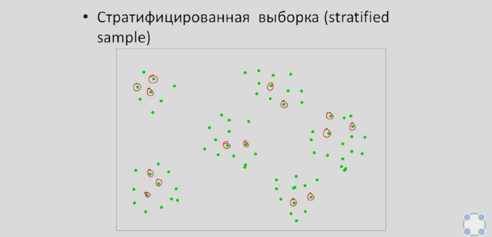

3. Групповая (кластерная) выборка. Совокупность также разделяется на группы, но не по какому-то признаку, а случайным образом. Следующим шагом выбираются несколько групп, из которых элементы берутся также случайно.

---
## Типы переменных
Переменными выборки называют те или иные признаки объектов, которые собираются исследовать. Они бывают нескольких видов.

**Количественные** — переменные, которые можно измерить (к примеру, рост). Если переменная может принимать любое значение на определённом промежутке, то она называется **непрерывной** количественной переменной (например, рост в промежутке от 150 до 200). **Дискретными** переменными называются те, которые могут принять отдельное возможное значение с определённой вероятностью (количество детей в семье).

**Номинативные (качественные)** — также бывают двух видов. Первые — **номинальные** переменные, использующиеся как имена для групп. Например, можно обозначить группу мужчин за x, а группу женщин за y. Вторые — **ранговые** переменные, представляющие упорядоченные категории. К примеру, степень удовлетворённости обслуживанием в кафе или порядковый номер бегуна в забеге.

---
## Меры центральной тенденции
Гистограмма частот — графическое представление распределения количественного признака.

Познакомимся с типами описательных статистик. 

**Меры центральной тенденции** — значения, вычисленные тем или иным путём исходя из графика, описывающие множество значений самого графика.

Допустим, имеются 1000 значений некоторой количественной переменной. Требуется описать эти данные всего одним числом, содержащим ценную информацию.

1. **Мода** — значение измеряемого признака, встречающееся наиболее часто.

    Рассмотрим следующий график. Числом, которое встречается чаще всего, является 172 — оно и будет модой распределения. 
    
    Исключим одно значение, равное 172. Теперь имеем моду сразу из трёх значений: 167, 170, 172.

    

2. **Медиана** — значение признака, которое делит **упорядоченное** множество данных пополам.

    При &lt;u&gt;нечётном&lt;/u&gt; количестве элементов медианой является середина множества. При &lt;u&gt;чётном&lt;/u&gt; же — среднее арифметическое двух центральных значений признака.

    Возьмём только первые 9 чисел из упорядоченного множества на графике. Имеем след. значения: 157, 159, 161, 164, 165, 166, 167, 167, 167. В данном случае медианой является 165.

3. **Среднее значение** — среднее арифметическое всех значений признака.

    Данный показатель (вернее, среднее арифметическое) обладает некоторыми свойствами:
    * Если каждый элемент выборки увеличить на одно и то же число, то и среднее значение увеличится на это число.
    * Если каждый элемент выборки умножить на одно и то же число, то и среднее значение у на это число.
    * Если для каждого значения выборки рассчитать его отклонение от среднего арифметического, то сумма этих отклонений будет равна 0.  

    Обозначение: \\(\Mu/\mu\\) — для ГС или \\(\bar{x}\\) — для выборки

Представленное выше распределение симметрично, унимодально (имеет одну моду) и не имеет заметных выбросов, поэтому для его описания можно использовать любую меру.

---
## Меры изменчивости
Чтобы рассчитать показатели, характеризующие изменчивость исследуемого признака, можно использовать следующие меры:

1. **Размах** (range) — разность между максимальным и минимальным значением распределения. Данная мера использует всего два значения, из-за чего не является достаточно показательной.  
    Обозначение: \\(R\\)

2. **Дисперсия** — средний квадрат отклонений индивидуальных значений признака от их средней величины. 

    Она вычисляется по следующей формуле: \\(D = \frac{\sum(x_i - \bar{x})^2}{n}\\). Важно уточнить, что данная формула применима только к генеральной совокупности. Для расчёта дисперсии выборки из знаменателя вычитают единицу: \\(D = \frac{\sum(x_i - \bar{x})^2}{n-1}\\)  
    Обозначение: \\(D\\) или \\(\sigma^2\\)

3. **Среднеквадратичное (стандартное) отклонение** — реальное среднее значение отклонений, получаемое извлечением корня из дисперсии. Соответственно, для нахождения, пользуемся формулой:
    $$
    \sqrt{\sigma = \frac{\sum(x_i - \bar{x})^2}{n-1}}
    $$
    Обозначение: \\(\sigma\\) — для ГС или \\(sd\\) — для выборки

    Разберём некоторые свойства дисперсии:  
    1. \\(D_{x&#43;c} = D_x\\)  
    \\(sd_{x&#43;c} = sd_x\\)  
    2. \\(D_{xc} = D_x * x^2\\)  
    \\(sd_{xc} = sd_x * x\\)

---
## Квантили распределения, box plot
**Квантили** — такие значения признака, которые делят упорядоченные данные на некоторое число равных частей.

**Квартили** — 3 квантиля, которые делят распределение на 4 равные части.

**Box plot** (ящик с усами/боксплот) — график, компактно представляющий одномерное распределение вероятностей.  
Он показывает: 
* Медиану (средний квартиль на уровне 50%);
* Верхний квартиль (на уровне 75%);
* Нижний квартиль (на уровне 25%);
* Межквартильный размах (МКР — разница между верхним и нижним квартилями);
* Выбросы, т.е. те значения, которые выходят из промежутка [нижний квартиль - 1,5 * МКР; верхний квартиль &#43; 1,5 * МКР]

---
## Нормальное распределение
Нормальное распределение (распределение Гаусса) — унимодальное и симметричное распределение, в котором отклонения значений от стандартного равновероятны и подчиняются следующему вероятностному закону:
* в диапазоне \\(\pm\sigma\\) стандартных отклонений от среднего значения находится  34.1*2 ≈ 64% наблюдений
* в диапазоне \\(\pm2\sigma\\) стандартных отклонений от среднего значения (34.1 &#43; 13.6)*2 ≈ 95% наблюдений
* в диапазоне \\(\pm3\sigma\\) стандартных отклонений от среднего значения находится (34.1 &#43; 13.6 &#43; 2.1)*2 ≈ 100% наблюдений
* за последним диапазоном находится ≈ 0.1% наблюдений

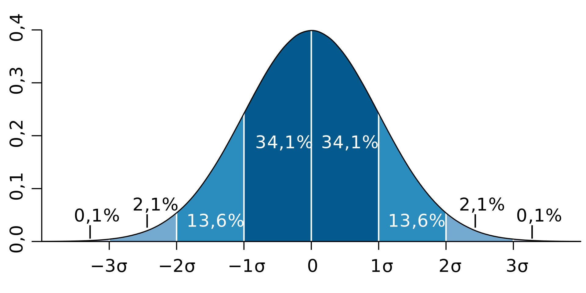

**Z-преобразование** (стандартизация) — преобразование распределения таким образом, чтобы его среднее значение стало равно 0, а среднеквадратичное отклонение — 1.

Осуществляется преобразование следующим образом:  
$$
 z_i = \frac{x_i - \bar{x}}{\sigma}
$$

При Z-преобразовании форма распределения никак не меняется:

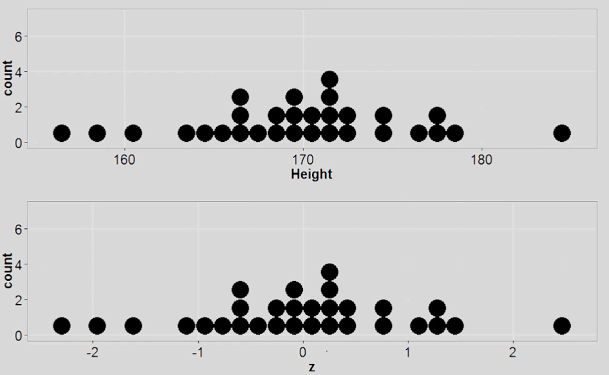

Другими словами, преобразование дает понять в скольких стандартных отклонениях находится отдельно взятое значение. Например, человек с ростом 186,2 находится примерно в 1.4 стандартных отклонениях от среднего (1.4*8 = 11,2, именно на столько отличается рост этого человека от среднего).

Z-преобразование позволяет найти процент наблюдений, находящийся в произвольном диапазоне. Пусть \\(\bar{x}=150\\), \\(sd=8\\). Требуется найти долю значений, превышающих 154. В таком случае \\(z = \frac{154 - 150}{8} = 0,5\\). Воспользуемся следующей таблицей. В ней Значения z представлены для значений **не больших чем z**, но нам нужно как раз обратное, поэтому вычитаем найденное число из единицы, получаем ≈ 0.3.

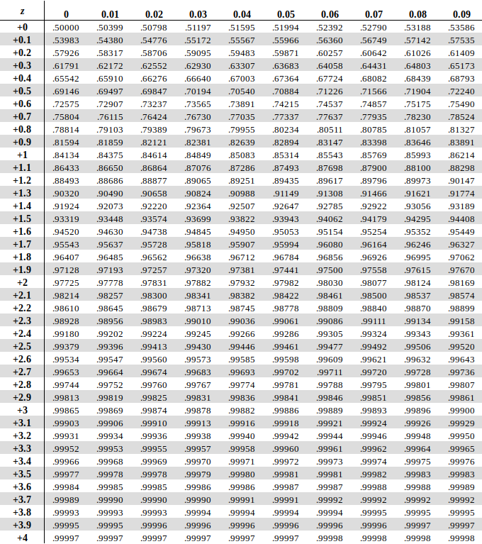

Для нахождения долей также можно воспользоваться [калькулятором](https://gallery.shinyapps.io/dist_calc/)

---
## Центральная предельная теорема
Центральная предельная теорема (ЦПТ) утверждает, что, при условии достаточного размера выборки, распределение выборочных средних приблизительно нормально со средним равным среднему признака в ГС, даже если распределение генеральной совокупности не является нормальным.

[Сайт](https://gallery.shinyapps.io/CLT_mean/) с симуляцией данных для центральной предельной теоремы.

Предположим, что некоторый признак распределён нормально в ГС и имеет \\(\mu = 15\\)

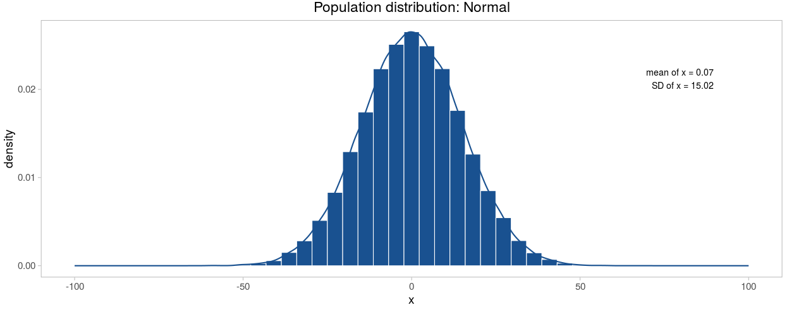

Многократно извлечём выборки по 50 наблюдений в каждой из ГС и взглянем на них. Внутри каждой рассчитано среднее значение и стандартное отклонение. Как видно, оба показателя варьируются от выборки к выборке, причём довольно сильно. 

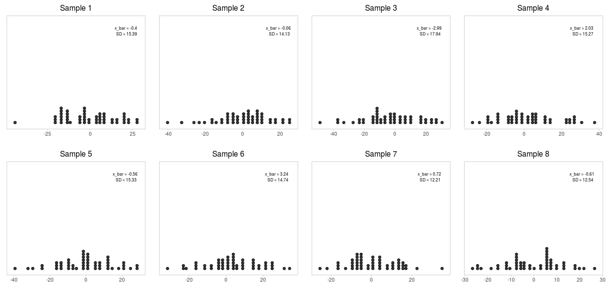

Теперь построим распределение выборочных средних значений. Взглянем на следующую картинку. Наше среднее выборочных средних (да-да) достаточно близко к среднему ГС.

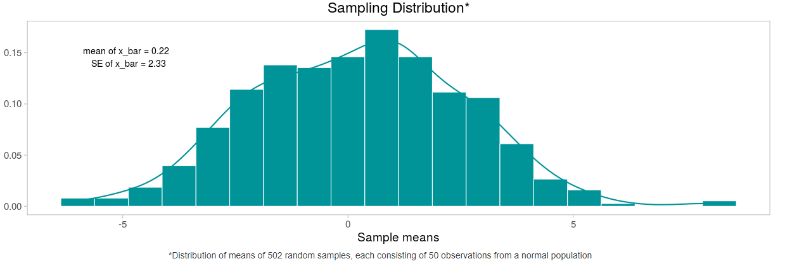

Стандартное отклонение такого распределения называется ошибкой среднего и показывает, насколько в среднем выборочное значение отклоняется от среднего в ГС.

Теперь увеличим объём каждой выборки до 500 наблюдений. Видим, что, во-первых, распределение в каждой выборке стало напоминать распределение в ГС, а во-вторых, выборочные оценки стали гораздо точнее.

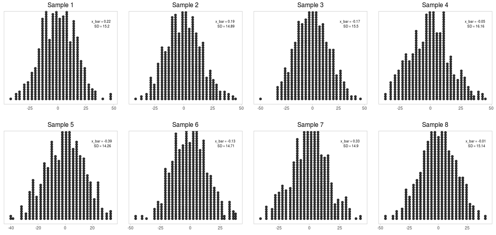

Снова вернёмся к распределению выборочных средних показателей. Как и ожидалось, стандартная ошибка значительно уменьшилась.

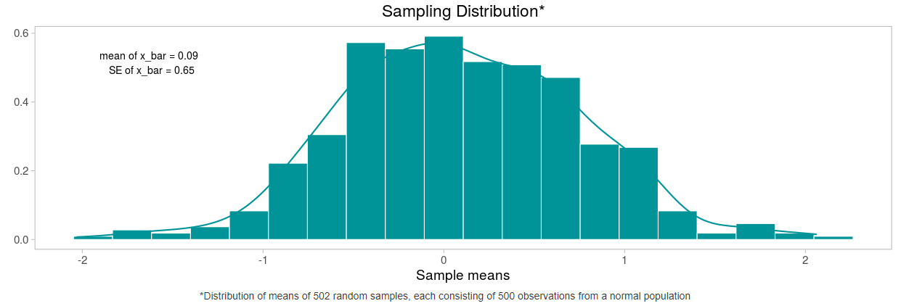

**Стандартная ошибка** — мера оценки математического ожидания генеральной совокупности \\(\mu\\) на основании выборочного среднего \\(\bar{x}\\). Вычисляется она по следующей формуле: 
$$
se = \frac{\sigma}{\sqrt{N}}
$$
, где N — число наблюдений ГС.  

Очевидно, что при увеличении количества наблюдений в выборке и уменьшении стандартного отклонения ГС, стандартная ошибка будет уменьшаться.

Для репрезентативных (элементы отобраны случайно) выборок с числом наблюдений больше 30 стандартная ошибка вычисляется похожим образом (при этом будет равна стандартной ошибке ГС):
$$
se_x = \frac{sd_x}{\sqrt{n}}
$$
, где n — число наблюдений выборки.

Таким образом, имея на руках только одну выборку, возможно предсказать, как бы вели себя все выборочные средние — они бы распределились вокруг среднего генеральной совокупности со стандартным отклонением равным \\(se\\).

Обозначение стандартной ошибки: \\(se\\)

---
## Доверительные интервалы для среднего
Доверительный интервал — интервал, в пределах которого с заданной вероятностью лежат выборочные оценки статистических характеристик ГС (в данном случае — среднее значение).

Разберём статистическую задачу. Нужно найти среднее значение (интервал, в котором оно будет с опред. долей вероятности) генеральной совокупности, о которой ничего не известно, зато есть выборка из 64 наблюдений, выборочное среднее которой равно 100, а среднеквадратичное отклонение — 4. 

Если бы эксперимент повторялся многократно, то все выборочные средние равномерно распределились бы относительно среднего ГС со стандартным отклонением \\(se\\). 95% всех выборочных средних лежали бы в диапазоне: \\(\bar{x}\pm 1,96 * \sigma\\). Так как выборка у нас всего одна, заменим \\(\sigma\\) на \\(se\\) — стандартную ошибку среднего.

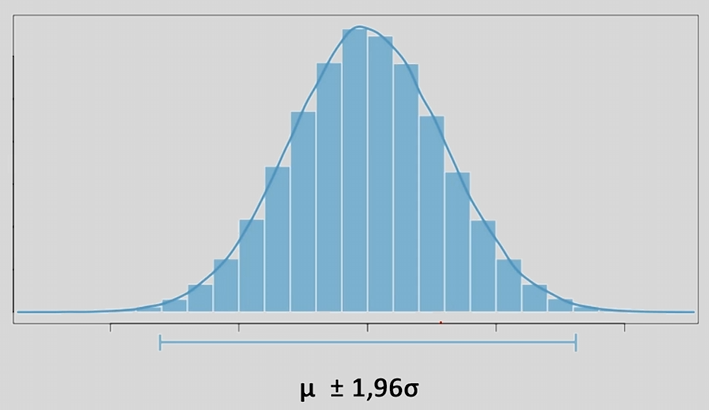

Неизвестно, где находится выборочное среднее, но известно, что среднее ГС располагается прямо по центру (вспоминаем центральную предельную теорему). Попробуем случайно поставить несколько выборочных средних и просчитать интервалы. Получим, что с вероятностью 0,95 имеющееся выборочное среднее будет включать среднее ГС.

Вычислим границы интервала, в центре которого — выборочное среднее: \\(a = 100 &#43; 1,96 * \frac{4}{\sqrt{64}} = 100,98\\) — правая граница; \\(b = 100 - 1,96 * \frac{4}{\sqrt{64}} = 99,02\\) — левая граница. 

И-так, рассчитав интервал таким образом, можно быть на 95% уверенным, что он содержит среднее значение ГС. Увеличивая степень уверенности, расширяется интервал.

---
## P-уровень значимости
**Нулевая гипотеза** (обозн. \\(H_0\\)) — предположение о том, что не существует связи между двумя наблюдаемыми событиями.

**P-value** (p-уровень значимости) — вероятность получить для распределения случайной величины значений такое же или более экстремальное значение (медиана, среднее и т.д.), по сравнению с ранее наблюдаемым, при условии, что нулевая гипотеза верна. Неформально, p-value — вероятность ошибки в случае отклонении нулевой гипотезы.  
Чем меньше уровень значимости, тем больше оснований отклонить нулевую гипотезу. Считается, что при \\(p &lt; 0,05\\) (что весьма и весьма спорно), можно принимать альтернативную гипотезу. В ином случае — оснований для отклонения нулевой гипотезы недостаточно. 

**Идея статистического вывода** — допустим, нулевая гипотеза верна, т.е. никаких различий или взаимосвязей в ГС нет. Теперь можно рассчитать вероятность того, что имеющиеся отклонения были получены абсолютно случайно.

* Рассмотрим пример. Предположим, что на выздоровление при некотором заболевании в среднем требуется 20 дней, однако был разработали новый препарат, и нужно проверить, можно ли сократить этот срок. Была набрана выборка из 64 пациентов, на которых опробовали новый метод лечения. Оказалось, что средний срок выздоровления сократился до 18,5 дней при стандартном отклонении равным 4. Какой вывод можно сделать основываясь на данных?

    Нулевая гипотеза \\(H_0\\) — на самом деле никого воздействия новый препарат не оказывает, и среднее значение ГС тех пациентов, кто использует препарат, на самом деле не отличается от 20.

    Альтернативная гипотеза \\(H_1\\) — препарат влияет на скорость выздоровления, а среднее значение ГС тех, кто использует препарат, не равняется 20.

    Предположим, что верна нулевая гипотеза, тогда в соответствии с ЦПТ, при многократном повторении эксперимента выборочные средние распределились бы нормальным образом вокруг среднего ГС со стандартной ошибкой среднего \\(se=4/\sqrt{64}=0.5\\). Выясним, насколько далеко имеющееся выборочное среднее отклонилось от предполагаемого среднего ГС в единицах стандартного отклонения через z-преобразование: \\(z=\frac{\bar{x}-\Mu}{se}=\frac{18.5 - 20}{0.5}=-3\\). 

    Таким образом, если бы в ГС среднее значение на самом деле равнялось 20, то имеющееся выборочное среднее отклонилось бы от него на \\(-3\sigma\\) в левую сторону. Воспользуемся свойством нормального распределения, чтобы рассчитать в [калькуляторе](https://gallery.shinyapps.io/dist_calc/) вероятность такого или еще больше выраженного отклонения от среднего значения.

    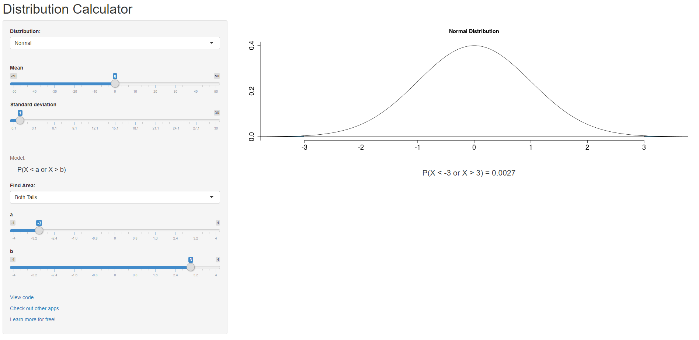

    Получается, вероятность отклониться от среднего больше чем на 3 стандартных отклонения равняется приблизительно 0,0027, а значит, можно смело отвергать нулевую гипотезу.

**Ошибка первого рода** (\\(\alpha\\)-ошибка, ложноположительное заключение) — ситуация, когда отвергнута верная нулевая гипотеза.  
**Ошибка второго рода** (\\(\beta\\)-ошибка, ложноотрицательное заключение) — ситуация, когда принята неверная нулевая гипотеза.

---

---

> Автор: [NoisyCake](https://t.me/noisy_cake)  
> URL: http://localhost:1313/posts/notes/basics_of_statistics/  

